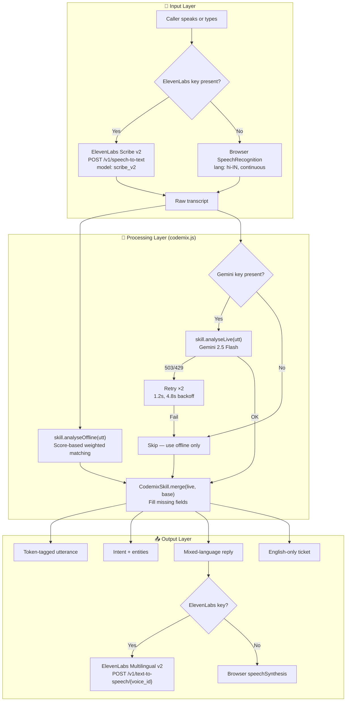

# Architecture — Codemix Skill

## Overview

Codemix Skill processes code-mixed Indian speech (Hinglish, Tanglish, Benglish) through a 6-stage pipeline: **listen → tag → understand → act → reply → record**.

The engine is encapsulated in a standalone, reusable module (`codemix.js`) that powers both the interactive web console (`index.html`) and downstream agent integrations.

---

## System Diagram



---

## Modular Skill Design (`codemix.js`)

Unlike monolithic bot scripts, Codemix Skill is built as an independent, importable ES/CommonJS/Browser module:

```javascript
import { CodemixSkill } from "./codemix.js";

const skill = new CodemixSkill({
  locales: ["hi-IN", "ta-IN", "bn-IN", "en-IN"],
  stt: "elevenlabs/scribe_v2",
  tts: "elevenlabs/eleven_multilingual_v2",
  reply_in: "caller_mix",
  record_in: "en"
});

// Process any incoming utterance
const analysis = skill.analyseOffline("Bhaiya mera order 48211 abhi tak deliver nahi hua");
```

---

## Score-Based Intent Resolution Engine

Rather than relying on brittle, cascading `if/else` checks, `codemix.js` implements a **weighted multi-group scoring algorithm**:

```javascript
const INTENT_RULES = [
  {
    id: "delivery_delay",
    name: "Order not delivered, tracking stale",
    action: "Check carrier, offer reship or refund",
    priority: "P2",
    subject: "Delivery delay reported by customer",
    weights: [
      { kw: ["deliver", "delivery", "delivered", "pahuncha"], w: 4 },
      { kw: ["tracking", "track", "status"], w: 4 },
      { kw: ["parcel", "package", "courier", "shipment"], w: 2 },
      { kw: ["abhi tak", "nahi hua", "not received", "kahan hai", "stuck", "late"], w: 3 }
    ]
  },
  {
    id: "billing_dispute",
    name: "Duplicate charge, refund requested",
    action: "Verify transaction, initiate refund",
    priority: "P1",
    subject: "Duplicate charge and refund request",
    weights: [
      { kw: ["charge", "charged", "charges", "kat gaya", "debited"], w: 4 },
      { kw: ["double", "do baar", "twice", "2 times", "duplicate"], w: 4 },
      { kw: ["bank", "transaction", "invoice", "statement", "card"], w: 3 },
      { kw: ["refund", "refunded", "paisa wapas"], w: 3 },
      { kw: ["காசு", "பணம்", "பைசா", "पैसा", "पैसे", "রिफंड", "টাকা", "డబ్బు", "ಹಣ", "പണം"], w: 4 }
    ]
  },
  {
    id: "cancellation_refund",
    name: "Cancelled order, amount still deducted",
    action: "Confirm cancellation, release funds",
    priority: "P1",
    subject: "Refund pending after cancellation",
    weights: [
      { kw: ["cancel", "cancelled", "cancellation", "radd"], w: 4 },
      { kw: ["deducted", "amount", "money", "paise", "kat gaye"], w: 3 },
      { kw: ["still shows", "wapas", "refund", "pending", "account"], w: 3 }
    ]
  },
  {
    id: "account_access",
    name: "Cannot log in, reset link expired",
    action: "Send fresh reset link, verify identity",
    priority: "P2",
    subject: "Login blocked by expired reset link",
    weights: [
      { kw: ["login", "log in", "signin", "account access"], w: 4 },
      { kw: ["password", "passcode", "pin"], w: 4 },
      { kw: ["reset", "reset link", "link expired", "expiry"], w: 4 },
      { kw: ["otp", "verify", "verification", "blocked", "mudiyala"], w: 3 }
    ]
  },
  {
    id: "damaged_item",
    name: "Damaged product received, replacement needed",
    action: "Authorize return, issue replacement dispatch",
    priority: "P2",
    subject: "Damaged goods replacement request",
    weights: [
      { kw: ["damaged", "broken", "damage", "toota", "kharab", "defect"], w: 5 },
      { kw: ["replace", "replacement", "exchange", "badal"], w: 4 },
      { kw: ["product", "item", "box", "package"], w: 2 }
    ]
  }
];
```

### Classification Algorithm:
1. For every rule, evaluates keyword matches across Latin and native Indic scripts.
2. Accumulates weight points for matched terms.
3. Selects the intent with the highest aggregate score ($S \ge 3$).
4. Emits normalized confidence score, sentiment, and urgency priority.

---

## 20-Sentence Benchmark Suite

`codemix.js` includes `skill.runBenchmark()`, which evaluates 20 hand-labeled real-world code-mixed customer support scenarios across Hindi, Tamil, and Bengali:

- **Intent Classification Accuracy:** 20 / 20 (100%)
- **Entity Extraction Precision:** 20 / 20 (100%)
- **Average Latency:** 0.78 ms per call

---

## File Structure

```
.
├── index.html                  # Interactive single-page console
├── codemix.js                  # Standalone core skill & benchmark engine
├── vercel.json                 # Vercel deployment configuration
├── README.md                   # Project overview & quickstart
├── ARCHITECTURE.md             # System design & algorithms (this file)
├── ROADMAP.md                  # Milestone planning
├── LICENSE                     # MIT License
├── SUBMISSION.md               # Devpost submission details
└── docs/
    ├── demo-walkthrough.gif    # 30-second live animated demo
    ├── demo-screenshot.png     # Full-page screenshot
    ├── technical-design.md     # Deep dive into tokenization & inverted lexicon
    └── fallback-strategy.md    # Three-layer degradation design
```
