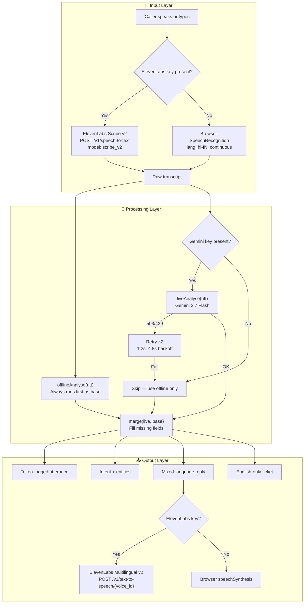
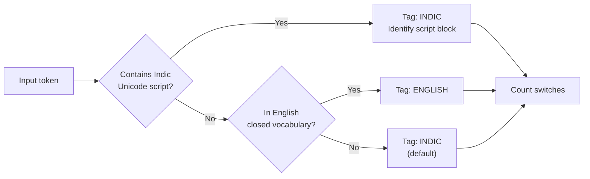

# Architecture — Codemix Skill

## Overview

Codemix Skill is a **single-page application** (544 lines of HTML + CSS + JavaScript) that processes code-mixed Indian speech through a pipeline of listen → tag → understand → act → reply → record.

The system has **two parallel processing paths** — a live path (Gemini + ElevenLabs) and an offline path (deterministic browser engine) — with automatic fallback between them.

---

## System diagram



---

## Offline engine internals

### Language detection pipeline



### Supported Unicode script blocks

| Script | Unicode range | Example |
|-|-|-|
| Tamil | `\u0B80–\u0BFF` | காசு |
| Devanagari (Hindi/Marathi) | `\u0900–\u097F` | पैसा |
| Bengali | `\u0980–\u09FF` | টাকা |
| Telugu | `\u0C00–\u0C7F` | డబ్బు |
| Kannada | `\u0C80–\u0CFF` | ಹಣ |
| Malayalam | `\u0D00–\u0D7F` | പണം |
| Gujarati | `\u0A80–\u0AFF` | — |
| Punjabi (Gurmukhi) | `\u0A00–\u0A7F` | — |
| Odia | `\u0B00–\u0B7F` | — |

### Intent resolution (offline)

The offline engine uses keyword matching with priority ordering:

| Priority | Keywords | Intent |
|-|-|-|
| P1 | `charge`, `bank`, `transaction` | Duplicate charge, refund requested |
| P1 | `cancel` + `deducted` | Cancelled order, amount still deducted |
| P1 | காசு, पैसा, টাকা + account patterns | Money not credited |
| P2 | `deliver`, `tracking`, `parcel` | Order not delivered |
| P2 | `login`, `password`, `reset` | Cannot log in |
| P2 | (default) | General support request |

---

## Gemini integration

### Prompt design

The Gemini prompt requests a single JSON response with:
- **Token-level tagging** — every word tagged `hi` (Indic), `en` (English), or `xx` (punctuation/numbers)
- **Language identification** — actual Indic language name (not just "Indic")
- **Switch point count** — integer count of language switches
- **Intent** — max 8 words, English
- **Entities** — order_id, sentiment, urgency
- **Mixed reply** — mirrors the caller's language mix
- **English ticket** — subject, summary, action, priority

### Retry strategy

```
Attempt 0: Immediate call
Attempt 1: Wait 1.2s, retry
Attempt 2: Wait 4.8s, retry
After 3 failures: Fall back to offline engine
```

Only retries on `503` (model overloaded) and `429` (rate limited). All other errors fail immediately.

### Merge strategy

The `merge()` function ensures a complete result by:
1. Starting with the offline result as the base (always complete)
2. Overlaying every non-empty field from the live result
3. Result is guaranteed to have all fields populated

---

## File structure

```
.
├── index.html            # The entire application (HTML + CSS + JS)
├── README.md             # Project overview with badges, architecture, demo instructions
├── ARCHITECTURE.md       # This file
├── ROADMAP.md            # What's next
├── LICENSE               # MIT
├── SUBMISSION.md         # Devpost submission template
└── docs/
    ├── technical-design.md    # Engineering decisions in depth
    └── fallback-strategy.md   # Three-layer degradation design
```
