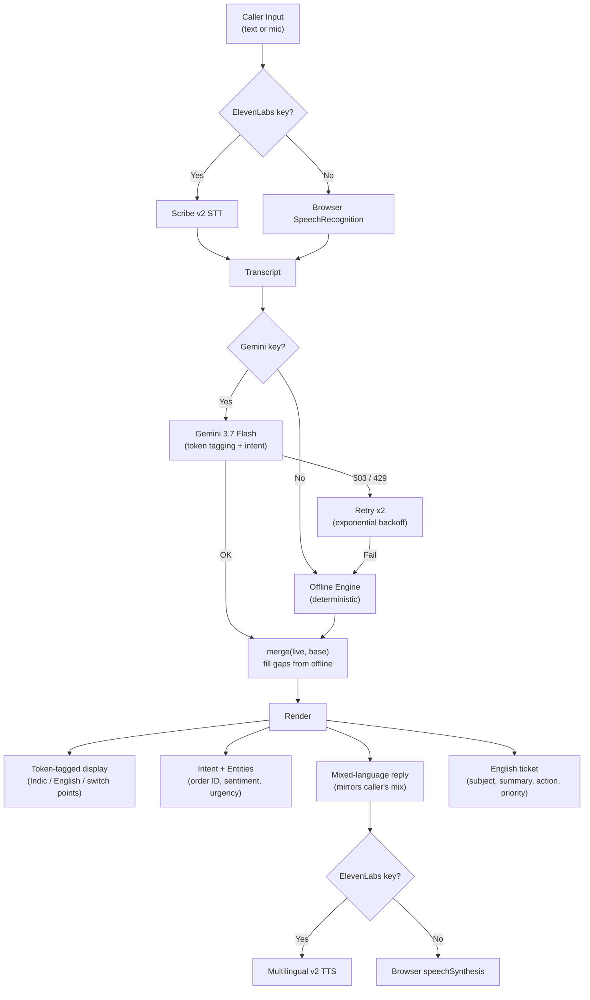

# Codemix Skill

A support agent skill that reads code-mixed Indian speech, acts on it, replies in the
caller's own mix, and writes the ticket in English.

Built for The Great Agent Hackathon (TGPF 2026).

## The problem

Voice agents advertise 70+ languages. But "multilingual" means you pick one language
and stay in it. Indian callers don't. They start a sentence in Tamil and finish it in
English. They drop English product names into a Hindi sentence.

Break the sentence and you break the intent. The agent asks the customer to repeat.
That is where support calls die.

## What this does

1. Listens to the caller, in whatever mix they use
2. Tags each word by language and finds the switch points inside the sentence
3. Pulls one intent out of the mixed speech
4. Looks up the order and decides an action
5. Replies in the caller's own mix
6. Writes the ticket in English, so search, routing, reporting and QA all read one language

The customer speaks how they speak. The company's records stay in one language.

## Architecture



## Why it is a skill, not a bot

Any agent on the platform can call it — support, sales, HR. The agent keeps its own
logic and stops breaking when the customer switches language.

```
agent.use("codemix", {
  locales: \["hi-IN", "ta-IN", "en-IN"],
  stt: "elevenlabs/scribe\_v2",
  tts: "elevenlabs/eleven\_multilingual\_v2",
  reply\_in: "caller\_mix",
  record\_in: "en"
});
```

## Stack

|Part|What we use|
|-|-|
|Listening|ElevenLabs Scribe v2|
|Understanding|Gemini 3.7 Flash|
|Speaking|ElevenLabs Multilingual v2|
|Agent|Freshworks Agent Studio|
|Fallback|Deterministic engine in the browser|

## Running it

Open `index.html` in Chrome. It works with no keys at all, on the built-in engine.

For the full version, click **Keys** and add:

* A Gemini API key from [Google AI Studio](https://aistudio.google.com)
* An ElevenLabs API key, then press **Load my voices** and pick an Indian voice

Keys stay in the browser tab. They are never saved and never committed.

## The fallback matters

Every step degrades instead of failing:

* Gemini down or rate limited → retries twice, then falls back to a deterministic
engine that runs entirely in the browser
* ElevenLabs unavailable → falls back to the browser voice
* Live model returns an incomplete answer → missing fields fill from the built-in result

We added this after hitting a Gemini 503 mid-build. A demo that dies on venue wifi
is not a demo.

## Language coverage

Works on both native script and romanized text.

* Native script: Tamil, Devanagari, Bengali, Telugu, Kannada, Malayalam, Gujarati,
Punjabi, Odia
* Romanized: Hinglish, Tanglish, and others via a closed English vocabulary — anything
outside that list is treated as Indic

Known failure mode: rare English words missing from the vocabulary get tagged as Indic.
The live model does not have this limitation; only the offline fallback does.

## Not done yet

* No accuracy measurement on a labelled set. That is the next piece of work.
* Keys currently live in the browser. Before any public deployment they move to a
small backend — ElevenLabs' own docs say not to ship a key to the client.
* Order lookup is a fixture, not a real system.

## Team

* Ramanathan 
* Sadhana 

