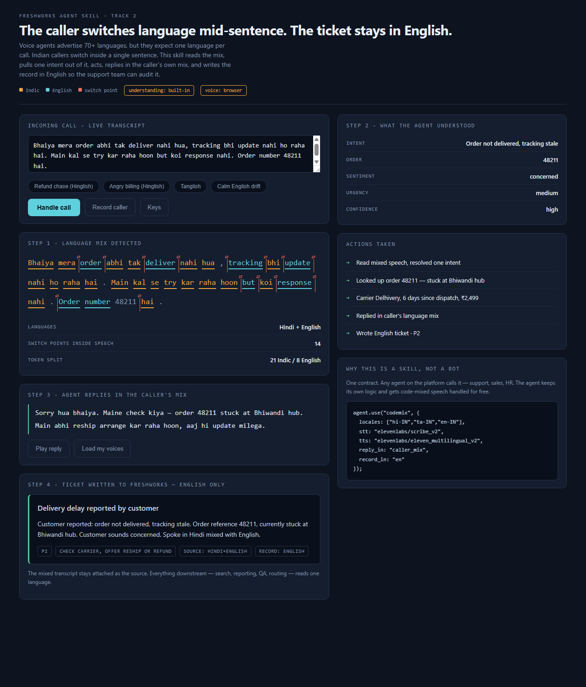
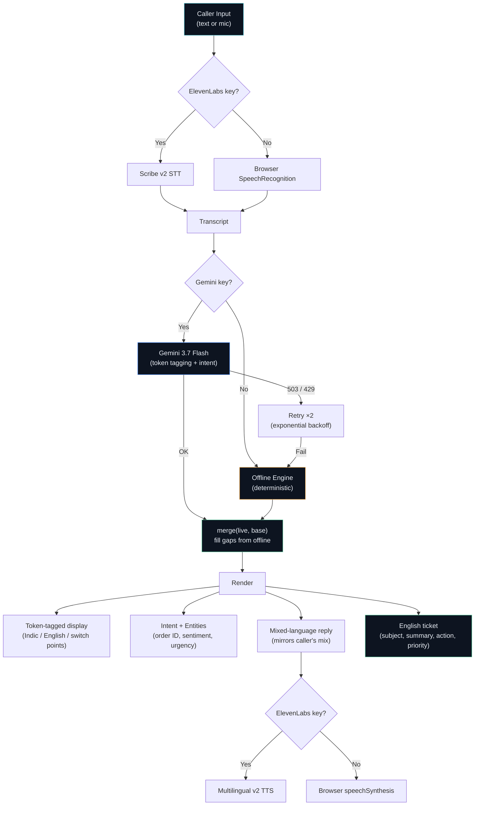

<div align="center">

# Codemix Skill

### **The caller switches language mid-sentence. The ticket stays in English.**

#### A reusable agent skill for code-mixed Indian support calls — built for **The Great Agent Hackathon 2026** by Team **Ramanathan & Sadhana**.

<br>

[](#-running-the-demo)
[](https://the-great-agent-hackathon.devpost.com/)
[](https://devpost.com/software/codemix-skill-code-mixed-support-calls-english-tickets)


<br><br>



<br>

> [!IMPORTANT]
> **Zero-install demo.** Open `index.html` in Chrome — it works immediately on the built-in engine with no API keys. Add a Gemini key and an ElevenLabs key for the full live version. Keys stay in the browser tab and are never saved.

</div>

---

## 📑 Table of Contents

| | | | |
|-|-|-|-|
| [The problem](#-the-problem) | [The solution](#-the-solution) | [Architecture](#-architecture) | [Running the demo](#-running-the-demo) |
| [Language coverage](#-language-coverage) | [Fallback strategy](#-the-fallback-matters) | [Tech stack](#-tech-stack) | [Key engineering decisions](#-key-engineering-decisions) |
| [What's next](#-roadmap) | [Evaluation rubric](#-evaluation-rubric-mapping) | [Team](#-team) | [Docs](#-documentation) |

---

## 🩺 The problem

> [!WARNING]
> **"Multilingual" support is broken for Indian callers.** Voice agents advertise 70+ languages, but they expect one language per call. Indian callers don't comply.

```
"Bhaiya mera order abhi tak deliver nahi hua, tracking bhi update nahi ho raha hai"
 ↑ Hindi  ↑ Hindi  ↑ English      ↑ English ↑ Hindi   ↑ English ↑ English  ↑ Hindi

 6 language switches in one sentence. Every existing agent breaks here.
```

| What happens today | Impact |
|-|-|
| Caller switches language mid-sentence | Agent loses the intent |
| Agent asks caller to repeat in one language | Caller gets frustrated, hangs up |
| Indian SMBs can't staff large support teams | Missed tickets, lost revenue |

Before writing code, we checked whether someone had already solved this. We found warm-transfer briefing agents, AI roleplay trainers, stale-knowledge detectors — all shipped products. **What we could not find was an agent that handles a language switch *inside* a sentence and still keeps a clean English record.** So we built that.

---

## 💡 The solution

**Codemix Skill** sits between speech and intent:

| Step | What happens |
|-|-|
| **1. Listen** | Records the caller in whatever mix they use (Tanglish, Hinglish, Benglish, etc.) |
| **2. Tag** | Tags each word by language and finds the switch points *inside* the sentence |
| **3. Understand** | Pulls one unified intent out of the mixed speech |
| **4. Act** | Looks up the order and decides an action |
| **5. Reply** | Responds in the caller's own language mix |
| **6. Record** | Writes the ticket in clean English |

**The idea in one line:** The customer speaks how they speak, and the company's records stay in one language.

### Why it's a skill, not a bot

Any agent on the platform can call it — support, sales, HR. The agent keeps its own logic and stops breaking when the customer switches language.

```javascript
agent.use("codemix", {
  locales: ["hi-IN", "ta-IN", "en-IN"],
  stt: "elevenlabs/scribe_v2",
  tts: "elevenlabs/eleven_multilingual_v2",
  reply_in: "caller_mix",
  record_in: "en"
});
```

---

## 🏗️ Architecture



> [!NOTE]
> See [ARCHITECTURE.md](ARCHITECTURE.md) for the full technical design, including the offline engine internals, the Gemini prompt, and the merge strategy.

---

## 🚀 Running the demo

### Zero-key mode (works immediately)

```
1. Clone this repo
2. Open index.html in Chrome
3. Click "Handle call" — the built-in engine processes the sample input
```

### Full mode (Gemini + ElevenLabs)

```
1. Open index.html in Chrome
2. Click "Keys"
3. Add a Gemini API key from https://aistudio.google.com
4. Add an ElevenLabs API key
5. Click "Load my voices" and pick an Indian-accented voice
6. Click "Handle call" or "Record caller"
```

> [!CAUTION]
> **Keys stay in the browser tab.** They are never saved, never committed, and go only to Google and ElevenLabs. For a public deployment, move both keys to a backend — never ship a key to the browser in production.

### Sample inputs included

| Label | Language mix | What it tests |
|-|-|-|
| Refund chase (Hinglish) | Hindi + English | Order tracking, delivery delay |
| Angry billing (Hinglish) | Hindi + English, frustrated tone | Duplicate charge, refund |
| Tanglish | Tamil + English (romanized) | Login blocked, password reset |
| Calm English drift | English → Hindi → English | Cancelled order, pending refund |

---

## 🌐 Language coverage

Works on both **native script** and **romanized** text.

| Type | Languages |
|-|-|
| **Native script** | Tamil, Devanagari (Hindi/Marathi), Bengali, Telugu, Kannada, Malayalam, Gujarati, Punjabi, Odia |
| **Romanized** | Hinglish, Tanglish, Benglish, and others via a closed English vocabulary |

> [!NOTE]
> **Known limitation:** Rare English words missing from the ~150-word vocabulary get tagged as Indic in the offline engine. The live Gemini model does not have this limitation.

### The key insight: inverted detection

Most systems list Indic words and default everything else to English. **We inverted it.** Support English is a small, predictable vocabulary (~150 words). Indian languages have thousands of inflected forms you'd never enumerate. So English is the closed list, and anything outside it defaults to Indic.

This single decision made Tamil, Hindi, Bengali, and Marathi all work immediately.

---

## 🛡️ The fallback matters

Every step degrades instead of failing:

| Layer | Primary | Fallback | Trigger |
|-|-|-|-|
| **Listening** | ElevenLabs Scribe v2 | Browser SpeechRecognition | No ElevenLabs key |
| **Understanding** | Gemini 3.7 Flash | Deterministic offline engine | No key, 503, 429, or bad JSON |
| **Speaking** | ElevenLabs Multilingual v2 | Browser speechSynthesis | No key or TTS error |
| **Data completeness** | Live model response | `merge(live, base)` fills gaps | Partial model output |

We added this after hitting a **Gemini 503 mid-build**. A demo that dies on venue wifi is not a demo.

> [!NOTE]
> See [docs/fallback-strategy.md](docs/fallback-strategy.md) for implementation details.

---

## 🔧 Tech stack

| Part | Technology | Why |
|-|-|-|
| **Listening** | ElevenLabs Scribe v2 | Doesn't force a single language up front |
| **Understanding** | Gemini 3.7 Flash | Token-level language tagging, intent extraction, English ticket — all in one call |
| **Speaking** | ElevenLabs Multilingual v2 | Holds quality across code-mixed speech |
| **Agent surface** | Freshworks Agent Studio | Where the skill plugs in for production use |
| **Offline engine** | Vanilla JavaScript | Unicode-aware tokenizer, script-block detection, keyword intent — 120 lines |
| **Frontend** | Single HTML file | Zero dependencies, zero build step, opens in any browser |

---

## 🔑 Key engineering decisions

| Decision | What we did | Why |
|-|-|-|
| **English as closed set** | ~150-word English vocabulary; everything else defaults to Indic | Indian languages have unlimited inflected forms; support English doesn't |
| **Unicode tokenizer** | `[\p{L}\p{M}\p{N}']+` instead of `\w+` | `\w` is ASCII-only — it shreds Tamil script into single characters |
| **Script-block detection** | Unicode ranges for 9 Indic scripts | Native script always wins over romanized heuristics |
| **Gemini thought filtering** | Filter `thought` parts from response | Gemini 3's internal reasoning parts aren't output |
| **Exponential backoff** | `1200 × attempt²` ms delay on 503/429 | Respects rate limits without giving up too fast |
| **Merge strategy** | `merge(live, base)` fills missing fields | A partial Gemini response never blanks the screen |

> [!NOTE]
> See [docs/technical-design.md](docs/technical-design.md) for the full writeup.

---

## 🗺️ Roadmap

See [ROADMAP.md](ROADMAP.md) for the full plan.

| Priority | Item | Status |
|-|-|-|
| 1 | Backend proxy for API keys | 🔲 Planned |
| 2 | Accuracy benchmarks on labelled code-mixed dataset | 🔲 Planned |
| 3 | Real order/CRM API integration | 🔲 Planned |
| 4 | Multi-intent handling | 🔲 Planned |
| 5 | Expand EN vocabulary from support corpus | 🔲 Planned |

---

## 📊 Evaluation rubric mapping

| Criterion | Where to look |
|-|-|
| **Problem clarity** | [The problem](#-the-problem) — quantified with real caller behavior |
| **Technical depth** | [Architecture](#-architecture), [ARCHITECTURE.md](ARCHITECTURE.md), [Key decisions](#-key-engineering-decisions) |
| **Working demo** | Open `index.html` — works with zero setup |
| **Innovation** | Inverted language detection, mid-sentence switch handling |
| **Fallback / resilience** | [Fallback strategy](#-the-fallback-matters) — three-layer degradation |
| **Skill reusability** | `agent.use("codemix", {...})` contract — any agent can call it |
| **Honest gaps** | [Roadmap](#-roadmap) — no fake accuracy numbers |

---

## 📁 Documentation

| Document | Description |
|-|-|
| [ARCHITECTURE.md](ARCHITECTURE.md) | Full technical architecture with diagrams |
| [ROADMAP.md](ROADMAP.md) | What's next, prioritized |
| [docs/technical-design.md](docs/technical-design.md) | Engineering decisions in depth |
| [docs/fallback-strategy.md](docs/fallback-strategy.md) | Three-layer degradation design |
| [SUBMISSION.md](SUBMISSION.md) | Devpost submission template |

---

## 👥 Team

- **Ramanathan Manikandan** — [Devpost](https://devpost.com/ramanathan-manikandan)
- **Sadhana Shanmugam** — [Devpost](https://devpost.com/sadhanashanmugam-cse2025)

---

## 📄 License

[MIT](LICENSE)
