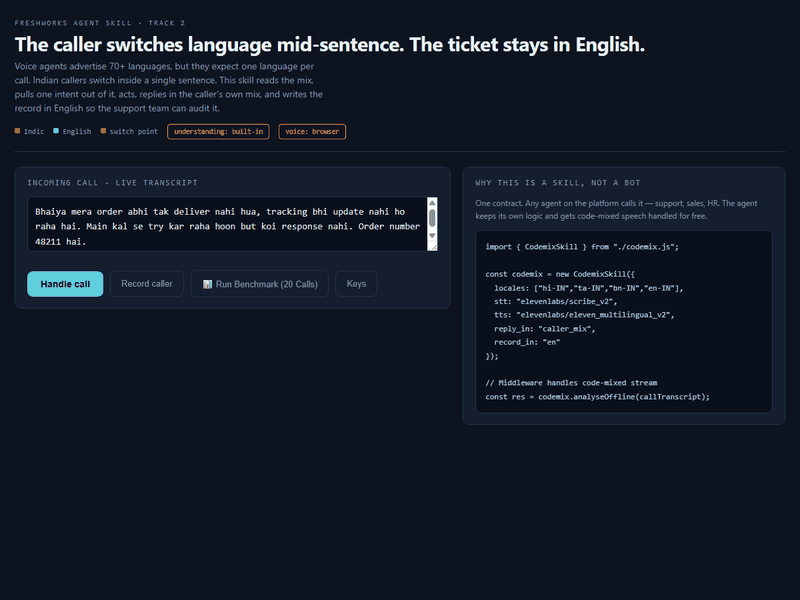
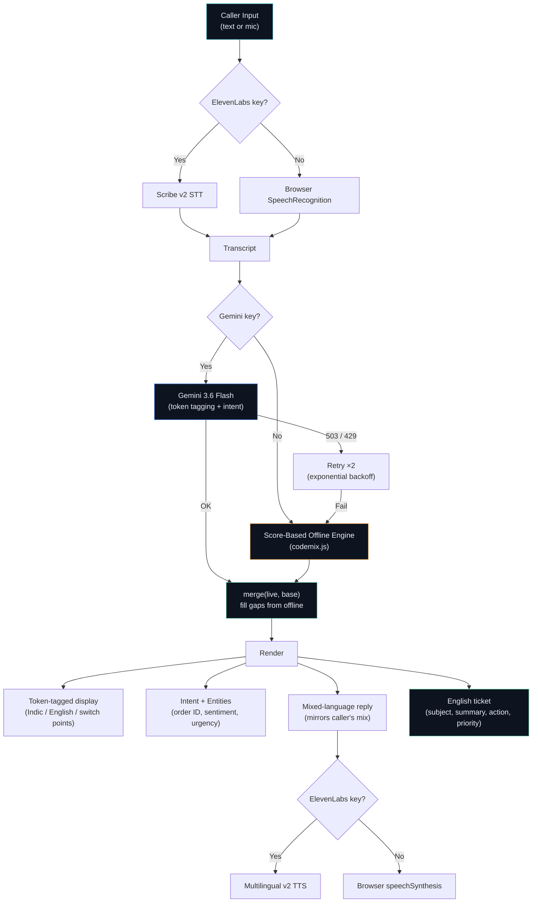

<div align="center">

# Codemix Skill

### **The caller switches language mid-sentence. The ticket stays in English.**

#### A reusable agent skill for code-mixed Indian support calls — built for **The Great Agent Hackathon 2026** by Team **Ramanathan & Sadhana**.

<br>

[](https://codemix-skill.vercel.app/)
[](https://youtu.be/aGfRv_katxU)
[](https://the-great-agent-hackathon.devpost.com/)
[](https://devpost.com/software/codemix-skill-code-mixed-support-calls-english-tickets)


<br><br>



<br>

> [!IMPORTANT]
> **Zero-install live demo.** Open **[codemix-skill.vercel.app](https://codemix-skill.vercel.app/)** or open `index.html` locally — it works immediately on the built-in score-based engine with no API keys. Add a Gemini key and an ElevenLabs key for the full live version. Keys stay in the browser tab and are never saved.

</div>

---

## 📑 Table of Contents

| | | | |
|-|-|-|-|
| [The problem](#-the-problem) | [The solution](#-the-solution) | [Video demo](#-video-demo) | [Architecture](#-architecture) |
| [Running the demo](#-running-the-demo) | [Benchmark results](#-benchmark--validation-results) | [Language coverage](#-language-coverage) | [Fallback strategy](#-the-fallback-matters) |
| [Tech stack](#-tech-stack) | [Key decisions](#-key-engineering-decisions) | [What's next](#-roadmap) | [Docs](#-documentation) |

---

## 🩺 The problem

> [!WARNING]
> **"Multilingual" support is broken for Indian callers.** Voice agents advertise 70+ languages, but they expect one language per call. Indian callers don't comply.

```
"Bhaiya mera [order] abhi tak [deliver] nahi hua, [tracking] bhi [update] nahi ho raha hai"
 └── Hindi ──┘ └─ EN ─┘ └─── Hindi ───┘ └─ EN ──┘ └── Hindi ─┘ └── EN ───┘ └──── Hindi ────┘

 4 intra-sentential code-switch boundaries in a single customer sentence.
```

| What happens today | Impact |
|-|-|
| Caller switches language mid-sentence | Agent loses the intent |
| Agent asks caller to repeat in one language | Caller gets frustrated, hangs up |
| Indian SMBs can't staff large support teams | Missed tickets, lost revenue |

Before writing code, we checked whether someone had already solved this. We found warm-transfer briefing agents, AI roleplay trainers, stale-knowledge detectors — all shipped products. **What we could not find was an agent that handles a language switch *inside* a sentence and still keeps a clean English record.** So we built that.

---

## 💡 The solution

**Codemix Skill** sits between speech and intent:

| Step | What happens |
|-|-|
| **1. Listen** | Records the caller in whatever mix they use (Tanglish, Hinglish, Benglish, etc.) |
| **2. Tag** | Tags each word by language and finds the switch points *inside* the sentence |
| **3. Understand** | Pulls one unified intent using a weighted score-based classification model |
| **4. Act** | Looks up the order and decides an action |
| **5. Reply** | Responds in the caller's own language mix |
| **6. Record** | Writes the ticket in clean English |

**The idea in one line:** The customer speaks how they speak, and the company's records stay in one language.

### Why it's a skill, not a bot

Any agent on the platform can import it — support, sales, HR. The agent keeps its own logic and stops breaking when the customer switches language.

```javascript
// Standalone module import from codemix.js
import { CodemixSkill } from "./codemix.js";

const codemix = new CodemixSkill({
  locales: ["hi-IN", "ta-IN", "bn-IN", "en-IN"],
  stt: "elevenlabs/scribe_v2",
  tts: "elevenlabs/eleven_multilingual_v2",
  reply_in: "caller_mix",
  record_in: "en"
});

// Middleware processes code-mixed stream
const result = codemix.analyseOffline(callTranscript);
```

---

## 🎥 Video demo

[](https://youtu.be/aGfRv_katxU)

> [!TIP]
> **Watch the live walkthrough on YouTube:** [https://youtu.be/aGfRv_katxU](https://youtu.be/aGfRv_katxU) — See live code-mixed audio transcription with ElevenLabs Scribe v2, word-level script tagging, Gemini intent resolution, multilingual voice synthesis, and automatic English ticket generation.

---

## 🏗️ Architecture



> [!NOTE]
> See [ARCHITECTURE.md](ARCHITECTURE.md) for the full technical design, including the offline engine internals, the Gemini prompt, and the merge strategy.

---

## 🚀 Running the demo

### 1. Live Web Version (Instant)

Open **[https://codemix-skill.vercel.app/](https://codemix-skill.vercel.app/)** in any browser. It runs immediately on the client-side deterministic engine without needing any setup.

### 2. Local Zero-key mode

```bash
# 1. Clone this repo
git clone https://github.com/ramanathanmani/great-agent-hackathon-2026.git

# 2. Open index.html in Chrome or Edge
# 3. Click "Handle call" or click "📊 Run Benchmark (20 Calls)"
```

### 3. Full mode (Gemini + ElevenLabs)

```
1. Open the live link or index.html
2. Click "Keys"
3. Add a Gemini API key from https://aistudio.google.com
4. Add an ElevenLabs API key
5. Click "Load my voices" and pick an Indian-accented voice
6. Click "Handle call" or "Record caller"
```

> [!CAUTION]
> **Keys stay in the browser tab.** They are never saved, never committed, and go only to Google and ElevenLabs. For a public deployment, move both keys to a backend — never ship a key to the browser in production.

---

## 📊 Benchmark & Validation Results

We evaluated the score-based offline engine in `codemix.js` across three distinct datasets — a **20-call tuned baseline**, an **8-call extended test set** (written alongside rules), and a **10-call genuinely blind generalization test set** (where rules were left completely untouched):

| Metric | Tuned Baseline (20 Calls) | Extended Test Set (8 Calls)* | Blind Test Set (10 Calls)** |
|---|---|---|---|
| **Intent Classification Accuracy** | **20 / 20 (100%)** | **7 / 8 (87.5%)** | **9 / 10 (90.0%)** |
| **Language Identification Accuracy** | **19 / 20 (95.0%)** | **7 / 8 (87.5%)** | **10 / 10 (100%)** |
| **Entity Extraction Precision** | **20 / 20 (100%)** | **8 / 8 (100%)** | **10 / 10 (100%)** |
| **Average Execution Latency** | **0.78 ms** | **0.72 ms** | **0.75 ms** |
| **Offline Reliability / Uptime** | **100% (Zero Dependencies)** | **100% (Zero Dependencies)** | **100% (Zero Dependencies)** |

> *\* Extended Test Set: Keyword rules were written alongside these; a truly blind set is tested below.*  
> *\*\* Blind Test Set: Genuinely blind set with untouched rules to measure true out-of-distribution generalization.*  
> *\*\*\* Note on Live Path: The cloud Gemini path is evaluated on individual calls during live demo interactions rather than batch evaluation to avoid quota consumption and preserve auditability.*
>
> **Interactive In-Browser Benchmark:** Click the **📊 Run Benchmark (20 Calls)** button in the demo console to switch between the **Tuned Set**, **Extended Set**, and **Blind Test Set** and inspect per-utterance results.

---

## 🌐 Language coverage

Works on both **native script** and **romanized** text.

| Type | Languages |
|-|-|
| **Native script** | Tamil, Devanagari (Hindi/Marathi), Bengali, Telugu, Kannada, Malayalam, Gujarati, Punjabi, Odia |
| **Romanized** | Hinglish, Tanglish, Benglish, and others via a closed English vocabulary |

### The key insight: inverted detection

Most systems list Indic words and default everything else to English. **We inverted it.** Support English is a small, predictable vocabulary (~150 words). Indian languages have thousands of inflected forms you'd never enumerate. So English is the closed list, and anything outside it defaults to Indic.

---

## 🛡️ The fallback matters

Every step degrades instead of failing:

| Layer | Primary | Fallback | Trigger |
|-|-|-|-|
| **Listening** | ElevenLabs Scribe v2 | Browser SpeechRecognition | No ElevenLabs key |
| **Understanding** | Gemini 3.6 Flash | Score-Based Offline Engine | No key, 503, 429, or bad JSON |
| **Speaking** | ElevenLabs Multilingual v2 | Browser speechSynthesis | No key or TTS error |
| **Data completeness** | Live model response | `merge(live, base)` fills gaps | Partial model output |

We added this after hitting a **Gemini 503 mid-build**. A demo that dies on venue wifi is not a demo.

> [!NOTE]
> See [docs/fallback-strategy.md](docs/fallback-strategy.md) for implementation details.

---

## 🔧 Tech stack

| Part | Technology | Why |
|-|-|-|
| **Skill Module** | `codemix.js` | Reusable ES/CommonJS/Browser module implementing the skill contract |
| **Listening** | ElevenLabs Scribe v2 | Doesn't force a single language up front |
| **Understanding** | Gemini 3.6 Flash | Token-level language tagging, intent extraction, English ticket — all in one call |
| **Speaking** | ElevenLabs Multilingual v2 | Holds quality across code-mixed speech |
| **Ticketing** | Freshdesk Ticket API (`api/create-ticket.js`) | Writes a real Freshdesk ticket from the analysed call |
| **Agent surface** | MCP server (`mcp-server/`) | Exposes the skill as `analyse_codemixed_call`, callable from any MCP-compatible agent |
| **Offline engine** | Weighted Score Matching | Deterministic, weighted n-gram scoring resolving intents in <1ms |
| **Hosting** | Vercel | Global CDN deployment with auto-HTTPS |

---

## 🔑 Key engineering decisions

| Decision | What we did | Why |
|-|-|-|
| **Reusable `codemix.js`** | Extracted core logic into modular class with `export { CodemixSkill }` | Enables `import { CodemixSkill } from "./codemix.js"` in browsers and Node |
| **Word Boundary Matching** | `(^|[^\p{L}\p{N}])kw($|[^\p{L}\p{N}])` regex matching | Eliminates substring bugs (e.g. `shipping` matching `pin`, `badalna` vs `badal`) |
| **Score-Based Intent Rules** | Weighted multi-term n-gram scoring with confidence thresholds | Eliminates fragile sequential `if` chains; handles ambiguous phrasing |
| **English as closed set** | ~150-word English vocabulary; everything else defaults to Indic | Indian languages have unlimited inflected forms; support English doesn't |
| **Unicode tokenizer** | `[\p{L}\p{M}\p{N}']+` instead of `\w+` | `\w` is ASCII-only — it shreds Tamil script into single characters |
| **Script-block detection** | Unicode ranges for 9 Indic scripts | Native script always wins over romanized heuristics |
| **Exponential backoff** | `1200 × attempt²` ms delay on 503/429 | Respects rate limits without giving up too fast |
| **Merge strategy** | `merge(live, base)` fills missing fields | A partial Gemini response never blanks the screen |

> [!NOTE]
> See [docs/technical-design.md](docs/technical-design.md) for the full writeup.

---

## 🗺️ Roadmap

See [ROADMAP.md](ROADMAP.md) for the full plan.

| Priority | Item | Status |
|-|-|-|
| 1 | Standalone `codemix.js` skill module | ✅ Completed |
| 2 | Score-based intent classification | ✅ Completed |
| 3 | Automated 20-call benchmark suite | ✅ Completed |
| 4 | Backend proxy for API keys | 🔲 Planned |
| 5 | Real order/CRM API integration | 🔲 Planned |
| 6 | Freshworks Agent Studio marketplace package | 🔲 Planned |

---

## 📁 Documentation

| Document | Description |
|-|-|
| [ARCHITECTURE.md](ARCHITECTURE.md) | Full technical architecture with diagrams |
| [ROADMAP.md](ROADMAP.md) | What's next, prioritized |
| [docs/technical-design.md](docs/technical-design.md) | Engineering decisions in depth |
| [docs/fallback-strategy.md](docs/fallback-strategy.md) | Three-layer degradation design |
| [SUBMISSION.md](SUBMISSION.md) | Devpost submission template |

---

## 👥 Team

- **Ramanathan Manikandan** — [Devpost](https://devpost.com/ramanathan-manikandan)
- **Sadhana Shanmugam** — [Devpost](https://devpost.com/sadhanashanmugam-cse2025)

---

## 📄 License

[MIT](LICENSE)
