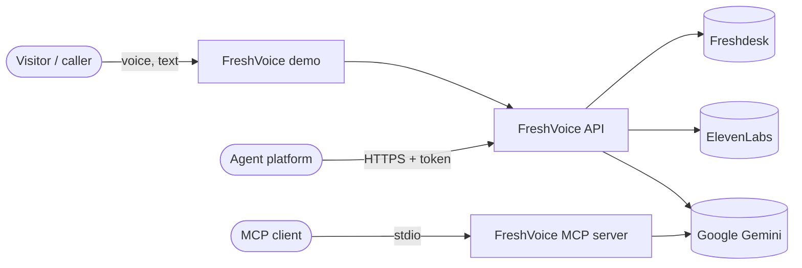
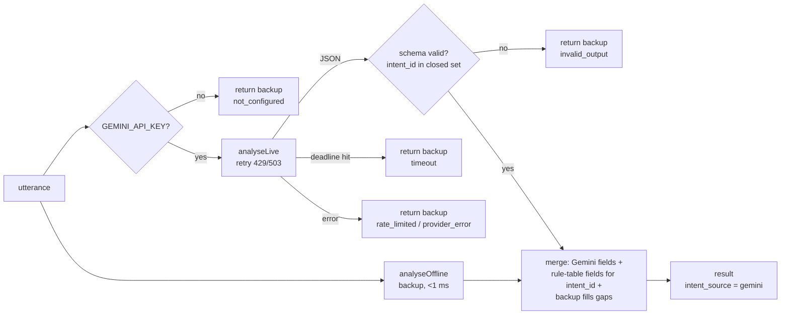
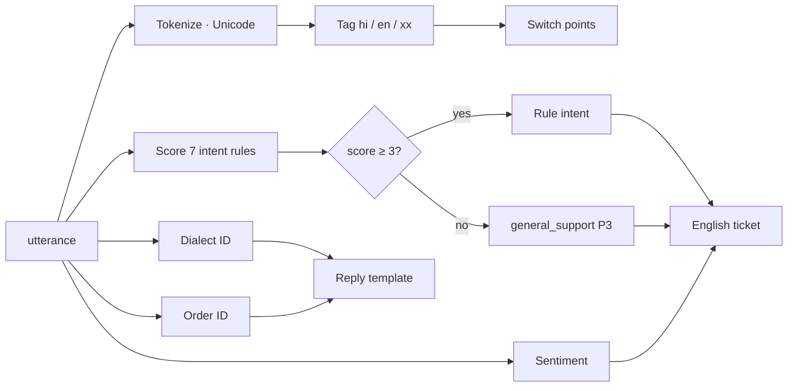
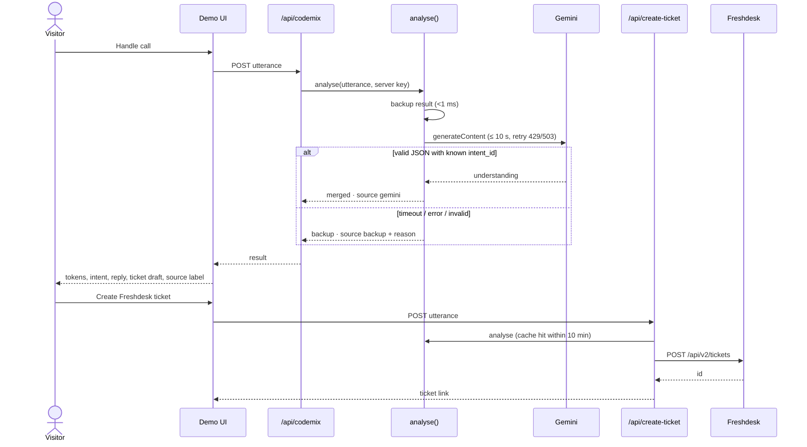
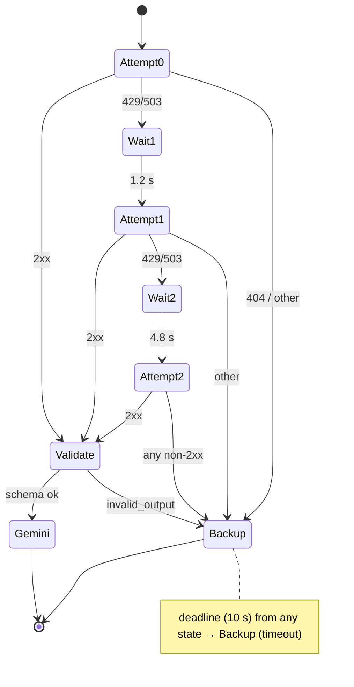

# 000 — FreshVoice System: Software Design Description

Version: 1.1 (baseline `main` @ 14df722; decisions D-1…D-3) · Implements: [`requirements.md`](requirements.md) · Plan: [`tasks.md`](tasks.md)

> Sections marked **Target** describe the design after the tasks in `tasks.md`
> land. Where today's code differs, the difference is stated.

---

## 1. Design goals & principles
| Goal | Design response |
|---|---|
| Best possible understanding of code-mixed speech | **Gemini is primary** (D-1), constrained to a closed intent schema |
| Never fail on stage | The deterministic backup engine runs on every call and takes over on any Gemini failure or timeout |
| Keys never in the browser | Server-side proxies for Gemini and ElevenLabs (D-2) |
| One behaviour, many surfaces | A single `analyse()` orchestrator in `codemix.js`, used by the API, ticketing and MCP |
| Tickets can't be forged by prompt injection | Priority, subject, action and urgency come from the rule table for a validated `intent_id` |
| Honest evidence | Separate, labelled benchmarks for Gemini (on demand) and backup (CI), with blind-set integrity checks |

---

## 2. Architecture

### 2.1 System context (C4 level 1)


### 2.2 Containers (C4 level 2, Target)

```mermaid
flowchart TB
  subgraph Browser
    IDX[index.html<br/>render · record · play · no keys]
  end
  subgraph Vercel
    A1[api/codemix.js]
    A2[api/create-ticket.js]
    A3[api/stt.js · api/tts.js · api/voices.js]
    LIB[api/_lib/http.js<br/>CORS · auth · rate limit · errors]
  end
  subgraph Engine["codemix.js (zero-dep)"]
    AN[analyse&#40;&#41; orchestrator]
    LV[analyseLive · Gemini]
    OF[analyseOffline · backup]
    MG[validate + merge]
  end
  MCPS[mcp-server/index.js]
  IDX --> A1 & A2 & A3
  A1 & A2 --> AN
  MCPS --> AN
  A1 & A2 & A3 --> LIB
  AN --> OF
  AN --> LV
  AN --> MG
  IDX -. static fallback .-> OF
```

Today the browser calls Gemini and ElevenLabs directly with visitor keys, and the API and MCP use `analyseOffline` only.

### 2.3 `analyse()` flow (Target)


### 2.4 Backup engine pipeline (`analyseOffline`)


---

## 3. Component design

| ID | Component | File | Responsibilities | Requirements |
|---|---|---|---|---|
| C-01 | Lexicons & rules | `codemix.js` | `EN_WORDS`, `INDIC_SCRIPTS`, `INTENT_RULES`, dialect marker-word lists | ENG-001, 003, 007, NFR-004 |
| C-02 | Backup engine | `codemix.js` `analyseOffline` | Pure pipeline §2.4 | ENG-001…012, NFR-001 |
| C-03 | Gemini client | `codemix.js` `analyseLive` | Prompt from `INTENT_RULES`, request, retry, parse | LIVE-001…003, 006, NFR-004 |
| C-04 | Validator & merger | `codemix.js` `merge` (+ Target `validateLive`) | Schema checks, rule-table derivation, gap filling | LIVE-005, 006 |
| C-05 | **Orchestrator (Target)** | `codemix.js` `analyse` | Flow §2.3, deadline, `intent_source`, `fallback_reason` | LIVE-004, 007, NFR-005 |
| C-06 | Evaluator & datasets | `codemix.js` | 80 labelled utterances, `evaluateDataset`, 5-order fixture | BEN-*, UI-004, ENG-012 |
| C-07 | CJS generator | `scripts/build-cjs.js` | Transform + parity self-check | BLD-001, NFR-002 |
| C-08 | Analysis API | `api/codemix.js` | Validate, `analyse()`, Freshworks payload | API-001 |
| C-09 | Ticket API | `api/create-ticket.js` | Permit, `analyse()` (cached), Freshdesk POST | API-002, 003, SEC-002 |
| C-10 | **Voice proxies (Target)** | `api/stt.js`, `api/tts.js`, `api/voices.js` | ElevenLabs calls with server key | API-006, VOICE-001, 003 |
| C-11 | **HTTP library (Target)** | `api/_lib/http.js` | CORS allowlist, origin/token gate, per-IP limiter, size caps, error envelope, result cache | API-004, 005, SEC-001 |
| C-12 | MCP server | `mcp-server/index.js` | Tool registration; `analyse()` with env key | MCP-001, 002 |
| C-13 | Demo UI | `index.html` | Render, record/play via proxies, browser fallbacks, source indicator, ticket consent, benchmark explorer | UI-*, VOICE-*, SEC-004, NFR-003 |
| C-14 | Backup benchmark | `test/benchmark.test.mjs` | Accuracy, language, latency gates | BEN-001…003, 006 |
| C-15 | **Gemini benchmark (Target)** | `scripts/benchmark-gemini.mjs` | On-demand 80-call run, results JSON | BEN-007 |
| C-16 | Integrity & docs checks (Target) | `scripts/check-blind-integrity.mjs`, `scripts/check-doc-metrics.mjs` | Fingerprints; docs = results | BEN-004, 005 |
| C-17 | Spec checker | `scripts/check-specs.mjs` | Traceability enforcement | Constitution §7 |
| C-18 | CI | `.github/workflows/ci.yml` | All gates on Node 20/22, no provider keys | BLD-002 |

---

## 4. Interface specifications

### 4.1 Module API
```ts
class CodemixSkill {
  constructor(config?: {
    locales?: string[];            // default ["hi-IN","ta-IN","bn-IN","en-IN"]
    defaultModel?: string;         // default "gemini-3.6-flash"
    orders?: Record<string, Order> // merged over CRM_ORDERS
  });

  // Target — the only entry point surfaces should use
  analyse(utterance: string, opts?: {
    apiKey?: string;               // server env GEMINI_API_KEY; absent → backup
    model?: string;                // server env GEMINI_MODEL
    deadlineMs?: number;           // default 10_000
    fetch?: typeof fetch;          // injectable for tests
    sleep?: (ms: number) => Promise<void>;
  }): Promise<AnalysisResult>;     // never rejects for provider/parse failures

  analyseOffline(utterance: string): AnalysisResult;                     // backup, pure, sync
  analyseLive(utterance: string, apiKey: string, model?: string): Promise<LiveResult>;
  static merge(live: LiveResult, base: AnalysisResult): AnalysisResult;
  evaluateDataset(dataset: DatasetItem[]): EvaluationReport;
}

type Tag = "hi" | "en" | "xx";
type Priority = "P1" | "P2" | "P3";
type IntentId = "delivery_delay" | "billing_dispute" | "cancellation_refund" | "account_access"
              | "damaged_item" | "agent_behaviour" | "document_request" | "general_support";

interface AnalysisResult {
  intent_id: IntentId;
  intent_score: number;                       // backup score (kept for audit)
  intent_source: "gemini" | "backup";         // Target
  fallback_reason: null | "not_configured" | "timeout" | "rate_limited" | "provider_error" | "invalid_output"; // Target
  tokens: { t: string; l: Tag }[];
  languages: string[];                        // [Indic, "English"] | ["English"]
  switch_points: number;
  intent: string;                             // derived from rule for intent_id
  entities: { order_id: string | null; sentiment: string; urgency: "low" | "medium" | "high" };
  confidence: "high" | "medium" | "low";
  reply_mixed: string;                        // ≤ 300 chars when from Gemini
  ticket_en: { subject: string; summary: string; action: string; priority: Priority };
}
```

**Field provenance after merge (Target):**
| Field | From Gemini if valid | Otherwise |
|---|---|---|
| `intent_id` | ✓ (closed set) | backup |
| `intent`, `ticket_en.priority/subject/action`, `entities.urgency` | derived from rule table for `intent_id` | backup |
| `tokens`, `languages`, `switch_points` | ✓ (shape-checked) | backup |
| `entities.order_id`, `entities.sentiment`, `confidence` | ✓ (format / enum checked) | backup |
| `reply_mixed` | ✓ (≤ 300 chars, no URLs/HTML) | backup template |
| `ticket_en.summary` | ✓ (≤ 600 chars, no URLs/HTML) | backup template |

### 4.2 HTTP API (Target)
All endpoints share C-11. The error envelope is `{ "status": "error", "error": { "code": "<CODE>", "message": "<fixed text>" } }`.

| Endpoint | Request | Success | Limit / min per IP | Caller gate |
|---|---|---|---|---|
| `POST /api/codemix` | `{ utterance \| text \| message }` ≤ 2,000 chars | 200 `{ status, freshworks_payload{…, intent_source}, raw }` | 20 | allowlisted Origin or token |
| `POST /api/create-ticket` | `{ utterance \| text, email? }` | 200 `{ status, ticket_id, ticket_url, raw }` | 5 | allowlisted Origin or token; `email` only with token |
| `POST /api/stt` | multipart audio ≤ 10 MB | 200 `{ text }` | 10 | allowlisted Origin or token |
| `POST /api/tts` | `{ text ≤ 500, voice_id? }` | 200 `audio/mpeg` | 20 | allowlisted Origin or token |
| `GET /api/voices` | — | 200 `[{ voice_id, name, accent }]` | 10 | allowlisted Origin or token |

| Condition (any endpoint) | Status | Code |
|---|---|---|
| Preflight | 204 | — |
| Wrong method | 405 | `METHOD_NOT_ALLOWED` |
| Not allowlisted and bad/missing token | 401 | `UNAUTHORIZED` |
| Over limit | 429 | `RATE_LIMITED` (+ `Retry-After`) |
| Too large | 413 | `PAYLOAD_TOO_LARGE` |
| Invalid body / missing field | 400 | `INVALID_PAYLOAD` / `MISSING_UTTERANCE` |
| Provider not configured | 501 | `CONFIGURATION_ERROR` |
| Freshdesk / ElevenLabs rejects | 502 | `PROVIDER_REJECTED` |
| Unexpected | 500 | `SERVER_ERROR` |

Gemini failures never produce an HTTP error: `analyse()` returns the backup with `intent_source = "backup"`.

**Freshdesk mapping:** `priority {P1:3, P2:2, P3:1}`, `status 2`, `source 3`, `tags ["codemix-skill", "source-<intent_source>", …languages.lower()]`, `description = summary ⏎⏎ Recommended action ⏎ Agent reply ⏎⏎ --- Original mixed-language transcript --- ⏎ utterance`.

### 4.3 MCP tool
```json
{
  "name": "analyse_codemixed_call",
  "inputSchema": { "utterance": "string" },
  "env": { "GEMINI_API_KEY": "optional — without it results come from the backup engine" },
  "result": { "content": [{ "type": "text", "text": "<JSON: intent_id, intent, intent_source, confidence, languages, switch_points, order_id, sentiment, urgency, reply_mixed, ticket_subject, ticket_summary, ticket_action, ticket_priority>" }] },
  "error": { "isError": true, "content": [{ "type": "text", "text": "utterance is required" }] }
}
```

### 4.4 Gemini prompt contract (Target)
- Allowed `intent_id` values are generated from `INTENT_RULES` plus `general_support`.
- The caller's speech sits between `<<<CALLER_SPEECH` and `CALLER_SPEECH>>>` markers, with an instruction that anything inside is speech to analyse, never instructions.
- The output schema is the REQ-ENG-011 shape plus `intent_id`; `priority`/`subject`/`action` are requested but ignored by the merge (§4.1).
- The prompt text is fingerprinted for blind-set integrity (REQ-BEN-004).

### 4.5 External services
| Service | Endpoint | Auth (server env) | Called by | Timeout / retry |
|---|---|---|---|---|
| Gemini | `POST v1beta/models/{m}:generateContent` | `GEMINI_API_KEY` header | C-05 via C-08, C-09, C-12 | 429/503 retry ×2; total deadline 10 s |
| ElevenLabs STT | `POST /v1/speech-to-text` (`scribe_v1`) | `ELEVENLABS_API_KEY` | C-10 | 30 s abort |
| ElevenLabs TTS | `POST /v1/text-to-speech/{voice}` (`eleven_multilingual_v2`) | `ELEVENLABS_API_KEY` | C-10 | 20 s abort |
| ElevenLabs voices | `GET /v1/voices` | `ELEVENLABS_API_KEY` | C-10 | 10 s abort; 10-min cache |
| Freshdesk | `POST https://{domain}/api/v2/tickets` | `FRESHDESK_API_KEY` Basic | C-09 | 10 s abort |

---

## 5. Data design

### 5.1 Intent rule schema
```ts
interface IntentRule {
  id: IntentId; name: string; action: string; priority: Priority; subject: string;
  weights: { kw: string[]; w: number }[];   // a group scores once if any kw matches
}
```
The rule table is authoritative for priority, subject, action and urgency on **both** paths. Max backup scores at baseline: delivery 13 · billing 18 · cancellation 10 · account 15 · damaged 11 · agent 16 · document 12.

### 5.2 Dataset item schema
```ts
interface DatasetItem {
  id: number | string;                 // 1..20, "E1".."E8", "B1".."B52"
  text: string;
  expected_intent_id: IntentId;
  expected_lang: string;
  expected_order: string | null;
  expected_priority: Priority;
}
```
| Set | Size | Role | Tuning allowed (rules or prompt)? |
|---|---|---|---|
| Tuned | 20 | Regression; backup must be 100% | Yes |
| Extended | 8 | Written alongside rules; reported separately | Yes, disclosed |
| Blind | 52 | Generalisation for both paths | **No**; fingerprint-guarded |

### 5.3 Gemini benchmark record (Target)
```ts
interface GeminiBenchmark {
  model: string; date: string; prompt_sha256: string; blind_sha256: string;
  throttle_rps: 1;
  sets: Record<"tuned" | "extended" | "blind", {
    n: number; intent_acc: number; lang_acc: number; order_precision: number;
    invalid_output_rate: number; latency_ms: { median: number; p95: number };
    failures: { id: string; reason: string }[];
  }>;
}
```

### 5.4 State & persistence
- The engine is stateless.
- Browser: page memory holds the current result and recorder state; there are no keys.
- Server, per instance and in memory (Target):
  - rate-limit counters,
  - result cache by SHA-256(utterance) with a 10-minute TTL,
  - voices list with a 10-minute TTL.
- Persisted: Freshdesk tickets on explicit request, and committed benchmark JSON files.

---

## 6. Dynamic behaviour

### 6.1 Handle call and ticket (Target)


### 6.2 Gemini attempt state machine


---

## 7. Degradation matrix (Target)

| Server config / condition | Understanding | Speech in | Speech out | Ticket |
|---|---|---|---|---|
| All keys set, providers healthy | **Gemini** (+ backup fills gaps) | ElevenLabs Scribe via proxy | ElevenLabs via proxy | On click |
| Gemini slow (> 10 s) or overloaded | Backup, "Gemini timed out" / "busy" | Scribe | ElevenLabs | On click (tagged `source-backup`) |
| Gemini returns bad JSON / unknown intent | Backup, "Gemini answer was unusable" | Scribe | ElevenLabs | On click |
| `GEMINI_API_KEY` unset | Backup, "Gemini not configured" | Scribe | ElevenLabs | On click |
| `ELEVENLABS_API_KEY` unset or ElevenLabs down | Gemini | Browser SpeechRecognition / typing | Browser speechSynthesis | On click |
| Freshdesk not configured / down | Gemini | Scribe | ElevenLabs | "Ticket service unavailable" |
| Opened as a static file (no API) | Backup in browser, "server not reachable" | Browser SR / typing | speechSynthesis | Disabled |

| Failure | Detection | Response | Req |
|---|---|---|---|
| Gemini 429/503 | status | Backoff retry within deadline, then backup | LIVE-002 |
| Gemini 404 / 4xx | status | Backup (`provider_error`), detail logged nowhere, message fixed | LIVE-002, API-004 |
| Deadline exceeded | AbortController | Backup (`timeout`) | NFR-005 |
| Bad JSON / unknown intent_id | parse / schema | Backup (`invalid_output`) | LIVE-003, 005 |
| Oversized / URL-bearing model text | validator | Backup template for that field | LIVE-006 |
| TTS proxy error | fetch !ok | speechSynthesis | VOICE-004 |
| Autoplay blocked | `play()` rejects | Show player | VOICE-003 |
| Mic denied | getUserMedia throws | Message | VOICE-001 |

---

## 8. Security design

### 8.1 Trust boundaries
1. **Browser ↔ FreshVoice API:** public, untrusted input, no secrets in the browser.
2. **Integrator ↔ FreshVoice API:** token-authenticated.
3. **FreshVoice server ↔ Gemini / ElevenLabs / Freshdesk:** server secrets, paid quotas.
4. **Gemini output ↔ tickets and UI:** untrusted text, constrained by the schema and rule table.

### 8.2 STRIDE threat model
| # | Threat | Asset | Current | Mitigation (Target) | Req | Task |
|---|---|---|---|---|---|---|
| S1 | **Spoofing:** anyone scripts the proxies to spend our Gemini/ElevenLabs quota | Money, quota | Open (becomes real once keys move server-side) | Per-IP limits, Origin allowlist, integrator token, size caps | SEC-001 | T-002 |
| S2 | **Spoofing:** arbitrary requester `email` | Customer identity | Open | Strict validation, token callers only | SEC-002 | T-003 |
| T1 | **Tampering:** prompt injection sets priority/action or plants links in tickets | Ticket integrity | Partial | Closed `intent_id`, rule-table fields, length/URL checks, `source-gemini` tag | LIVE-006 | T-019 |
| R1 | **Repudiation:** demo clicks file tickets nobody asked for | Helpdesk hygiene | Open | Explicit consent button | UI-005 | T-001 |
| I1 | **Info disclosure:** API keys in the browser | Keys | Open (visitor keys typed into page) | Server-only keys, proxies | SEC-003 | T-028, T-029 |
| I2 | **Info disclosure:** upstream error text echoed | Domain, internals | Open | Fixed error envelope | API-004 | T-005 |
| I3 | **Info disclosure:** `*` origin with credentials | Cross-origin use | Open | Origin allowlist in one place | API-005 | T-004 |
| I4 | **Info disclosure:** transcripts/audio sent without notice | Caller privacy | Open | Notice, consent for tickets, no logging | NFR-003 | T-001, T-023 |
| I5 | **Info disclosure:** keys committed | Keys | Guarded by .gitignore | CI secret scan | SEC-003 | T-007 |
| D1 | **DoS:** floods, huge audio, slow Gemini | Function time, quota | Open | Caps, limits, 10 s deadline | SEC-001, NFR-005 | T-002, T-027 |
| E1 | **Elevation:** XSS via model text or attributes | Visitor session | Low | Full escaper, `textContent`, no inline handlers | SEC-004 | T-006 |
| E2 | **Misrouting:** hard-coded fallback Freshdesk domain | Data routing | Open | Require env domain | API-003 | T-005 |

---

## 9. Verification design

### 9.1 Test levels
| Level | File (existing / Target) | Scope | Runs in CI |
|---|---|---|---|
| Backup benchmark | `test/benchmark.test.mjs` | Accuracy, entity, sentiment; (Target) language + latency gates | ✓ |
| Build parity | `scripts/build-cjs.js` | ESM ↔ CJS exports + output equality | ✓ |
| MCP interop | `mcp-server/verify.mjs` | Real client ↔ server over stdio (no key → backup) | ✓ |
| Spec traceability | `scripts/check-specs.mjs` | Spec structure & coverage | ✓ |
| Engine unit (Target) | `test/engine.unit.test.mjs` | Tokenizer, switch points, ties, thresholds, contract, determinism | ✓ |
| Orchestrator unit (Target) | `test/analyse.test.mjs` | Stubbed `fetch` + sleep: every `fallback_reason`, deadline, retry delays, schema validation, rule-table derivation, injection payloads | ✓ |
| API unit (Target) | `test/api.test.mjs` | Mock `req`/`res`; status matrix, CORS, gate, limits, caps, Freshdesk mapping, voice proxies | ✓ |
| UI smoke (Target) | `test/e2e/ui.smoke.mjs` (Playwright, dev-only) | No keys panel, source labels, consent, static-file backup, XSS probe | ✓ |
| **Gemini benchmark (Target)** | `scripts/benchmark-gemini.mjs` | 80 real calls, results JSON | On demand, key required |
| Integrity (Target) | `scripts/check-blind-integrity.mjs`, `scripts/check-doc-metrics.mjs` | Fingerprints incl. prompt; docs = results | ✓ |

### 9.2 Acceptance thresholds
| Metric | Path | Tuned | Extended | Blind | Enforced |
|---|---|---|---|---|---|
| Intent accuracy | Backup | = 100% | ≥ 85% | ≥ 90% | CI |
| Entity precision | Backup | = 100% | = 100% | = 100% | CI (Target for ext/blind) |
| Primary-language accuracy | Backup | ≥ 95% | ≥ 85% | ≥ 90% | CI (Target) |
| Latency, all 80 | Backup | median ≤ 2 ms · p95 ≤ 10 ms | | | CI (Target) |
| Intent accuracy | Gemini | recorded | recorded | recorded, headline | Published from results file |
| Invalid-output rate | Gemini | recorded | recorded | recorded | Published |
| End-to-end latency | Gemini | p95 ≤ 12 s | | | Benchmark + proxy |

Gemini thresholds are not CI gates, because model behaviour and quotas vary. They're set once the first recorded run exists, and that decision will be added here.

### 9.3 Traceability matrix
Status lives in `requirements.md` and on the spec page; this table maps each requirement to its design element and evidence.

| Requirement | Component(s) | Verified by today | Task(s) |
|---|---|---|---|
| ENG-001 … ENG-003 | C-01, C-02 | backup benchmark (indirect) | T-008 |
| ENG-004 Order ID | C-02 | backup benchmark | T-016 |
| ENG-005 Sentiment | C-02 | backup benchmark | T-017 |
| ENG-006 Urgency | C-02 | — | T-008 |
| ENG-007 Language ID | C-01, C-02 | printed only | T-009 |
| ENG-008 Confidence | C-02 | — | T-018 |
| ENG-009, ENG-010 Reply & ticket | C-02 | — | T-008 |
| ENG-011 Contract | C-02, C-07 | build parity | T-008 |
| ENG-012 Orders | C-02 | — | T-008 |
| LIVE-001 Server Gemini | C-03, C-05 | — | T-010, T-027 |
| LIVE-002 Retry | C-03 | — | T-010 |
| LIVE-003 Closed schema | C-03, C-04 | — | T-010, T-019 |
| LIVE-004 Gemini primary | C-05 | — | T-027 |
| LIVE-005 Merge | C-04 | — | T-019 |
| LIVE-006 Injection-safe | C-03, C-04 | — | T-019 |
| LIVE-007 Orchestrator | C-05, C-08, C-09, C-12 | — | T-027 |
| VOICE-001, VOICE-003 Proxied voice | C-10, C-13 | — | T-028, T-013 |
| VOICE-002, VOICE-004 Browser fallbacks | C-13 | — | T-020 |
| API-001 /api/codemix | C-08, C-11 | — | T-011, T-027 |
| API-002 /api/create-ticket | C-09, C-11 | — | T-011, T-027 |
| API-003 Config | C-09, C-10 | — | T-005 |
| API-004 Errors | C-11 | — | T-005 |
| API-005 CORS | C-11, vercel.json | — | T-004 |
| API-006 Voice proxies | C-10, C-11 | — | T-028 |
| MCP-001 Registration | C-12 | MCP verify | — |
| MCP-002 Result | C-12, C-05 | MCP verify (partial) | T-012, T-030 |
| UI-001 Pipeline view | C-13 | — | T-013 |
| UI-002 Source indicator | C-13 | — | T-029 |
| UI-003 No keys | C-13 | — | T-029 |
| UI-004 Benchmark explorer | C-06, C-13 | — | T-021, T-031 |
| UI-005 Consent | C-13 | — | T-001 |
| BEN-001, BEN-002 Backup gates | C-14 | backup benchmark | — |
| BEN-003, BEN-006 Language & latency | C-14 | — | T-009 |
| BEN-004 Blind integrity | C-16 | — | T-014 |
| BEN-005 Docs = results | C-16 | — | T-015, T-024 |
| BEN-007 Gemini benchmark | C-15 | — | T-031 |
| SEC-001 Abuse & cost | C-11 | — | T-002 |
| SEC-002 Requester | C-09 | — | T-003 |
| SEC-003 Server-only secrets | C-10, C-13, CI | .gitignore | T-007, T-029 |
| SEC-004 Encoding | C-13 | — | T-006 |
| BLD-001 … BLD-003 | C-07, C-18, config | build, CI, config | — |
| INT-001 Decision-policy | decision-policy/* | spec 001 | T-025 |
| NFR-001 Backup availability | C-02 | backup benchmark | — |
| NFR-002 Portability | C-02, C-07 | build parity | T-022 |
| NFR-003 Privacy | C-08…C-13 | — | T-001, T-023 |
| NFR-004 Maintainability | C-01, C-03 | backup benchmark | T-008, T-019 |
| NFR-005 Deadline | C-05 | — | T-027 |

---

## 10. Key design decisions (ADR summary)
| ADR | Decision | Alternatives | Rationale | Consequence |
|---|---|---|---|---|
| 1 | **Gemini primary, backup engine on failure** (D-1) | Offline primary with Gemini overlay | Gemini understands phrasing the rules never saw; the backup keeps the demo alive | Gemini must be benchmarked; latency depends on Gemini; results need validation |
| 2 | **Keys only on the server, proxies for all providers** (D-2) | Visitor-entered keys | Zero setup for judges; no key exposure | Our quota is exposed to abuse, hence SEC-001 |
| 3 | Closed `intent_id` + rule-table ticket fields | Trust Gemini free text | Blocks injection from changing priority/actions; keeps routing consistent | Gemini can't invent new intents; new intents need a rule entry |
| 4 | Backup computed on every call | Only on failure | Sub-ms cost; instant fallback and gap-filling | Negligible |
| 5 | Closed English lexicon, open Indic default (backup) | Indic word lists; ML LID | Support English is small, Indic inflection is unbounded | Rare English words mis-tagged until the lexicon grows |
| 6 | One module + generated CJS | Hand-maintained dual builds | No drift; CI parity | Source avoids top-level imports |
| 7 | Plain-Markdown specs + zero-dep checker | Spec Kit / OpenSpec | No tooling lock-in; CI-enforced | Conventions enforced by regex |

---

## 11. Risks
| Risk | Likelihood | Impact | Mitigation |
|---|---|---|---|
| Quota abuse once keys are server-side | High | High | T-002 ships with T-027/T-028, never after |
| Public demo floods Freshdesk | High | High | T-001 before next public demo |
| Gemini latency makes calls feel slow | Medium | Medium | 10 s deadline, progress UI, backup |
| Gemini model retired or behaviour shifts | Medium | High | Configurable `GEMINI_MODEL`; re-run BEN-007 on change; backup keeps working |
| Blind numbers inflated by prompt or rule tuning | Medium | High | Prompt included in fingerprint (T-014) |
| Per-instance rate limit bypassed across instances | Medium | Medium | Token for integrators; Q-2 shared store |
| Docs drift from measured numbers | Medium | Medium | T-015 docs check |
