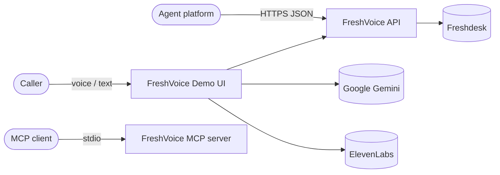
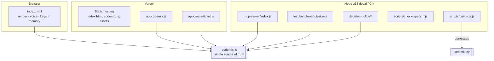
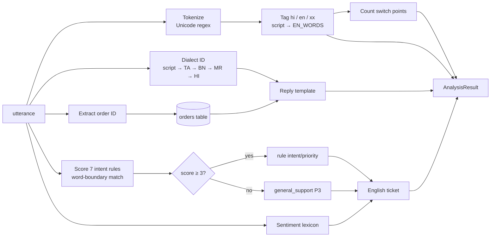
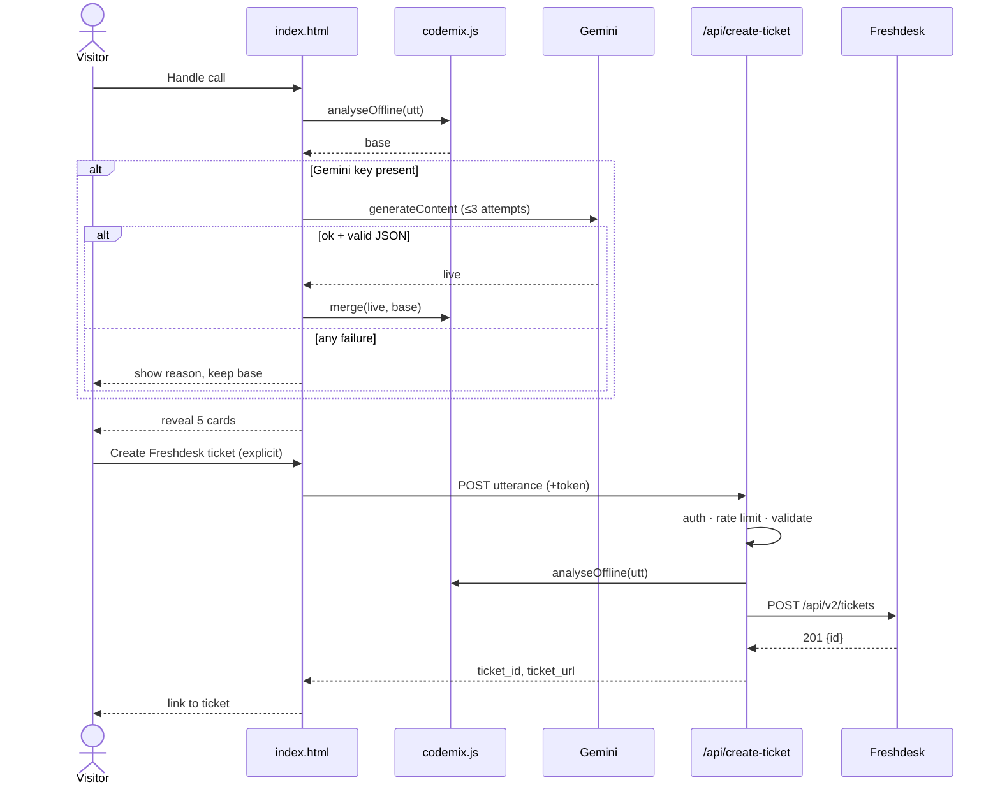
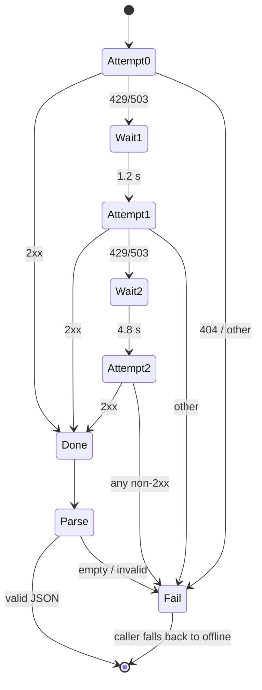

# 000 — FreshVoice System: Software Design Description

Version: 1.0 (baseline `main` @ 14df722) · Implements: [`requirements.md`](requirements.md) · Plan: [`tasks.md`](tasks.md)

> Sections marked **Target** describe the design after the tasks in `tasks.md`
> land. Everything else describes the code as it is at the baseline commit.

---

## 1. Design goals & principles
| Goal | Design response |
|---|---|
| Understand intra-sentential code-mixing | Inverted lexicon (closed English, open Indic) + Unicode script blocks |
| Never fail on stage | Offline engine always runs first; live services only *overlay* it |
| One engine, many surfaces | `codemix.js` imported by UI, API, MCP; CJS generated, never copied |
| Deterministic & testable | Pure function `analyseOffline`, data-driven `INTENT_RULES`, labelled datasets in-module |
| Honest evidence | Tuned / extended / blind separation, CI gates, published-number checks |

---

## 2. Architecture

### 2.1 System context (C4 level 1)


### 2.2 Containers (C4 level 2)


### 2.3 Engine pipeline (`analyseOffline`)


---

## 3. Component design

| ID | Component | File | Responsibilities | Requirements |
|---|---|---|---|---|
| C-01 | Lexicons & rules | `codemix.js` (`EN_WORDS`, `INDIC_SCRIPTS`, `INTENT_RULES`, dialect regexes) | Data that drives tagging, intent, dialect | ENG-001, 003, 007, NFR-004 |
| C-02 | Offline analyser | `codemix.js` `analyseOffline` | Pure pipeline in §2.3 | ENG-001…012, NFR-001 |
| C-03 | Live analyser | `codemix.js` `analyseLive` | Gemini request, retry, parse | LIVE-001…003, 006 |
| C-04 | Merger | `codemix.js` `merge` | Overlay + (Target) schema validation | LIVE-005 |
| C-05 | Evaluator | `codemix.js` `evaluateDataset`, `runBenchmark` | Accuracy/latency per dataset | UI-004, BEN-* |
| C-06 | Datasets & CRM fixture | `codemix.js` | 80 labelled utterances, 5 orders | BEN-*, ENG-012 |
| C-07 | CJS generator | `scripts/build-cjs.js` | Transform + parity self-check | BLD-001, NFR-002 |
| C-08 | Analysis API | `api/codemix.js` | Validate, analyse, shape Freshworks payload | API-001, 005 |
| C-09 | Ticket API | `api/create-ticket.js` | (Target) auth + rate limit, analyse, Freshdesk POST | API-002…005, SEC-001, 002 |
| C-10 | (Target) API shared lib | `api/_lib/http.js` | CORS allowlist, error envelope, token check, rate limiter | API-004, 005, SEC-001 |
| C-11 | MCP server | `mcp-server/index.js` | Tool registration & result shaping | MCP-001, 002 |
| C-12 | Demo UI | `index.html` | Render, keys, voice I/O, benchmark explorer, (Target) ticket consent | UI-*, VOICE-*, LIVE-004, SEC-004 |
| C-13 | Benchmark suite | `test/benchmark.test.mjs` | Accuracy/latency gates, sentiment checks | BEN-001…003, 006 |
| C-14 | Spec checker | `scripts/check-specs.mjs` | Traceability enforcement | Constitution §7 |
| C-15 | CI | `.github/workflows/ci.yml` | Run all gates on Node 20/22 | BLD-002 |

---

## 4. Interface specifications

### 4.1 Module API
```ts
class CodemixSkill {
  constructor(config?: {
    locales?: string[];            // default ["hi-IN","ta-IN","bn-IN","en-IN"]
    stt?: string;                  // informational, default "elevenlabs/scribe_v1"
    tts?: string;                  // informational, default "elevenlabs/eleven_multilingual_v2"
    reply_in?: "caller_mix";       // default
    record_in?: "en";              // default
    defaultModel?: string;         // default "gemini-3.6-flash"
    orders?: Record<string, Order> // merged over CRM_ORDERS
  });
  static getScriptOf(token: string): IndicScript | null;
  analyseOffline(utterance: string): AnalysisResult;                         // pure, sync
  analyseLive(utterance: string, apiKey: string, model?: string): Promise<Partial<AnalysisResult>>;
  static merge(live: Partial<AnalysisResult>, base: AnalysisResult): AnalysisResult;
  evaluateDataset(dataset: DatasetItem[]): EvaluationReport;
  runBenchmark(custom?: DatasetItem[]): EvaluationReport | SuiteReport;
}

type Tag = "hi" | "en" | "xx";
type Priority = "P1" | "P2" | "P3";

interface AnalysisResult {
  intent_id: IntentId | "general_support";
  intent_score: number;                       // 0..sum(weights)
  intent_source?: "offline" | "live";         // Target (REQ-LIVE-005)
  tokens: { t: string; l: Tag }[];
  languages: string[];                        // [Indic, "English"] | ["English"]
  switch_points: number;                      // ≥ 0
  intent: string;                             // English label
  entities: { order_id: string | null; sentiment: "frustrated" | "concerned" | string; urgency: "low" | "medium" | "high" };
  confidence: "high" | "medium" | "low";
  reply_mixed: string;                        // non-empty
  ticket_en: { subject: string; summary: string; action: string; priority: Priority };
}
```
Exports: `CodemixSkill` (also default), `CRM_ORDERS`, `BENCHMARK_DATASET`, `HELD_OUT_DATASET`, `BLIND_DATASET`, `INTENT_RULES`, `EN_WORDS`.

### 4.2 HTTP API

**`POST /api/codemix`**

| Case | Status | Body |
|---|---|---|
| Preflight | 200 | empty |
| Wrong method | 405 | `{error:{code:"METHOD_NOT_ALLOWED"}}` |
| Non-object body | 400 | `{error:{code:"INVALID_PAYLOAD"}}` |
| No `utterance`/`text`/`message` | 400 | `{error:{code:"MISSING_UTTERANCE"}}` |
| OK | 200 | `{status:"success", freshworks_payload:{…}, raw: AnalysisResult}` |
| Engine throws | 500 | `{error:{code:"ANALYSIS_FAILED"}}` |

**`POST /api/create-ticket`** — request `{ utterance | text: string, email?: string }`, header (Target) `X-FreshVoice-Token`

| Case | Status | Code |
|---|---|---|
| Wrong method | 405 | `METHOD_NOT_ALLOWED` |
| (Target) bad/missing token | 401 | `UNAUTHORIZED` |
| (Target) over rate limit | 429 | `RATE_LIMITED` |
| Missing key / (Target) domain | 501 | `CONFIGURATION_ERROR` |
| Invalid body / missing utterance | 400 | `INVALID_PAYLOAD` / `MISSING_UTTERANCE` |
| (Target) utterance > 2,000 chars | 413 | `PAYLOAD_TOO_LARGE` |
| Freshdesk rejects | upstream status | `PROVIDER_REJECTED` |
| Network/other | 500 | `SERVER_ERROR` |
| OK | 200 | `{status:"success", ticket_id, ticket_url, raw}` |

**Target error envelope (all endpoints):** `{ "status": "error", "error": { "code": "<CODE>", "message": "<fixed text>" } }`, with no upstream text.

**Freshdesk mapping:** `priority {P1:3, P2:2, P3:1}`, `status 2`, `source 3`, `tags ["codemix-skill", …languages.lower()]`, `description = summary ⏎⏎ Recommended action ⏎ Agent reply ⏎⏎ --- Original mixed-language transcript --- ⏎ utterance`.

### 4.3 MCP tool
```json
{
  "name": "analyse_codemixed_call",
  "inputSchema": { "utterance": "string" },
  "result": { "content": [{ "type": "text", "text": "<JSON: intent, confidence, languages, switch_points, order_id, sentiment, urgency, reply_mixed, ticket_subject, ticket_summary, ticket_action, ticket_priority>" }] },
  "error": { "isError": true, "content": [{ "type": "text", "text": "utterance is required" }] }
}
```

### 4.4 External services
| Service | Endpoint | Auth | Used by | Timeout / retry |
|---|---|---|---|---|
| Gemini | `POST v1beta/models/{m}:generateContent` | `x-goog-api-key` | C-03 (browser) | 3 attempts on 429/503; (Target) 20 s abort |
| ElevenLabs STT | `POST /v1/speech-to-text` (`scribe_v1`) | `xi-api-key` | C-12 | none |
| ElevenLabs TTS | `POST /v1/text-to-speech/{voice}` (`eleven_multilingual_v2`) | `xi-api-key` | C-12 | none |
| ElevenLabs voices | `GET /v1/voices` | `xi-api-key` | C-12 | none |
| Freshdesk | `POST https://{domain}/api/v2/tickets` | Basic `key:X` | C-09 | none; (Target) 10 s abort |

---

## 5. Data design

### 5.1 Intent rule schema
```ts
interface IntentRule {
  id: IntentId; name: string; action: string; priority: Priority; subject: string;
  weights: { kw: string[]; w: number }[];   // group scores once if any kw matches
}
```
Max scores at baseline: delivery 13 · billing 18 · cancellation 10 · account 15 · damaged 11 · agent 16 · document 12.

### 5.2 Dataset item schema
```ts
interface DatasetItem {
  id: number | string;                 // 1..20, "E1".."E8", "B1".."B52"
  text: string;
  expected_intent_id: IntentId;
  expected_lang: "Hindi" | "Tamil" | "Bengali" | "English" | string;
  expected_order: string | null;
  expected_priority: Priority;
}
```
| Set | Size | Role | Rule tuning allowed? |
|---|---|---|---|
| Tuned (`BENCHMARK_DATASET`) | 20 | Regression, must be 100% | Yes |
| Extended (`HELD_OUT_DATASET`) | 8 | Rules written alongside | Yes, but reported separately |
| Blind (`BLIND_DATASET`) | 52 | Generalisation | **No**; guarded by REQ-BEN-004 fingerprint |

### 5.3 Order fixture
`Order = { status: string; days: number; carrier: string; value: string }`, keyed by 5-digit ID; 5 entries (`48211, 33417, 99120, 55102, 77841`).

### 5.4 State & persistence
- The engine is stateless.
- The UI keeps API keys, the current result, and recorder state in page memory only.
- The server keeps no state; (Target) the rate limiter is per instance, in memory, best effort.
- Nothing is persisted except Freshdesk tickets created on explicit request.

---

## 6. Dynamic behaviour

### 6.1 Handle call (Target: with ticket consent)


### 6.2 Live-analysis retry state machine


---

## 7. Degradation matrix

| Gemini key | ElevenLabs key | Network | Understanding | STT | TTS | Ticket sync |
|---|---|---|---|---|---|---|
| — | — | any | Offline | Browser SR (Chrome) / typing | speechSynthesis | Explicit, if API reachable |
| ✓ | — | ok | Gemini ⊕ offline | Browser SR | speechSynthesis | Explicit |
| — | ✓ | ok | Offline | Scribe | ElevenLabs | Explicit |
| ✓ | ✓ | ok | Gemini ⊕ offline | Scribe | ElevenLabs | Explicit |
| ✓ | ✓ | down | Offline (reason shown) | Error, then typing | speechSynthesis | "unavailable" message |

| Failure | Detection | Response | Req |
|---|---|---|---|
| Gemini 429/503 | status | Backoff retry, then offline | LIVE-002 |
| Gemini 404 / 4xx | status | Immediate offline + message | LIVE-002 |
| Bad/partial JSON | parse/schema | Offline or field-wise fill | LIVE-003, 005 |
| Render exception | try/catch | Re-render offline | LIVE-004 |
| TTS error | fetch !ok | speechSynthesis | VOICE-004 |
| Autoplay blocked | `play()` rejects | Show player | VOICE-003 |
| Mic denied | getUserMedia throws | Message | VOICE-001 |
| Freshdesk down / rejects | fetch / status | Generic UI message | API-002, 004 |

---

## 8. Security design

### 8.1 Trust boundaries
1. **Browser ↔ internet:** visitor keys, transcripts.
2. **Public internet ↔ Vercel functions:** unauthenticated today.
3. **Vercel ↔ Freshdesk:** server secret.
4. **Model output ↔ UI/API:** untrusted text.

### 8.2 STRIDE threat model
| # | Threat | Asset | Current | Mitigation (Target) | Req | Task |
|---|---|---|---|---|---|---|
| S1 | **Spoofing:** anyone calls `/api/create-ticket` | Freshdesk quota, data quality | Open | Shared token + rate limit | SEC-001 | T-002 |
| S2 | **Spoofing:** arbitrary requester `email` | Customer identity | Open | Strict validation, auth-gated | SEC-002 | T-003 |
| T1 | **Tampering:** prompt injection steers ticket fields | Ticket integrity | Partial | Delimit + schema-validate; server stays offline | LIVE-006 | T-019 |
| R1 | **Repudiation:** demo clicks create tickets nobody asked for | Helpdesk hygiene | Open | Explicit consent button | UI-005 | T-001 |
| I1 | **Info disclosure:** upstream error text echoed | Domain, internals | Open | Fixed error envelope | API-004 | T-005 |
| I2 | **Info disclosure:** wildcard CORS + credentials | Cross-origin use | Open | Origin allowlist, single source | API-005 | T-004 |
| I3 | **Info disclosure:** keys committed | Keys | Guarded by .gitignore | CI secret scan | SEC-003 | T-007 |
| I4 | **Info disclosure:** transcripts sent without consent | Caller privacy | Open | Consent + documented data flow | NFR-003 | T-001, T-023 |
| D1 | **DoS:** huge payloads / floods | Function cost, quota | Open | 2,000-char cap, 429 | SEC-001 | T-002 |
| E1 | **Elevation:** XSS via attribute injection | Visitor session, keys | Low (static data) | Full escaper, no inline handlers | SEC-004 | T-006 |
| E2 | **Elevation:** hard-coded fallback domain sends tickets to a third-party helpdesk | Data routing | Open | Require env domain | API-003 | T-005 |

---

## 9. Verification design

### 9.1 Test levels
| Level | File (existing / Target) | Scope | Runs in CI |
|---|---|---|---|
| Benchmark | `test/benchmark.test.mjs` | Accuracy, entity, sentiment gates, (Target) language and latency gates | ✓ |
| Build parity | `scripts/build-cjs.js` | ESM ↔ CJS exports + output equality | ✓ |
| MCP interop | `mcp-server/verify.mjs` | Real client ↔ server over stdio | ✓ |
| Spec traceability | `scripts/check-specs.mjs` | Spec structure & coverage | ✓ |
| Engine unit (Target) | `test/engine.unit.test.mjs` | Tokenizer, switch points, ties, thresholds, contract, determinism | T-008 |
| Live unit (Target) | `test/live.test.mjs` | Stubbed `fetch`; retry timing via injected sleep; parsing | T-010 |
| API unit (Target) | `test/api.test.mjs` | Mock `req`/`res`, stubbed Freshdesk; status codes, mapping, CORS, auth | T-005, T-011 |
| UI smoke (Target) | `test/e2e/ui.smoke.mjs` (Playwright, dev-only) | Zero-key flow, mode chips, consent, XSS probe | T-013 |
| Integrity (Target) | `scripts/check-blind-integrity.mjs`, `scripts/check-doc-metrics.mjs` | Blind fingerprint; docs = RESULTS | T-014, T-015 |

### 9.2 Acceptance thresholds (CI-enforced)
| Metric | Tuned | Extended | Blind |
|---|---|---|---|
| Intent accuracy | = 100% | ≥ 85% | ≥ 90% |
| Entity precision | = 100% | (Target) = 100% | (Target) = 100% |
| Primary-language accuracy (Target) | ≥ 95% | ≥ 85% | ≥ 90% |
| Offline latency (Target, all 80) | median ≤ 2 ms · p95 ≤ 10 ms | | |

### 9.3 Traceability matrix
| Requirement | Pri | Current | Component(s) | Verified by (today) | Task |
|---|---|---|---|---|---|
| ENG-001 Tokenize & tag | Must | Met | C-01, C-02 | benchmark (indirect) | T-008 |
| ENG-002 Switch points | Must | Met | C-02 | — | T-008 |
| ENG-003 Intent scoring | Must | Met | C-01, C-02 | benchmark | T-008 |
| ENG-004 Order ID | Must | Partial | C-02 | benchmark | T-016 |
| ENG-005 Sentiment | Should | Partial | C-02 | benchmark | T-017 |
| ENG-006 Urgency | Must | Met | C-02 | — | T-008 |
| ENG-007 Language ID | Must | Met | C-01, C-02 | printed only | T-009 |
| ENG-008 Confidence | Should | Unmet | C-02 | — | T-018 |
| ENG-009 Mixed reply | Must | Met | C-02 | — | T-008 |
| ENG-010 English ticket | Must | Met | C-02 | — | T-008 |
| ENG-011 Output contract | Must | Met | C-02, C-07 | build parity | T-008 |
| ENG-012 Injectable orders | Could | Met | C-02 | — | T-008 |
| LIVE-001 Gemini request | Should | Met | C-03 | — | T-010 |
| LIVE-002 Retry policy | Must | Met | C-03 | — | T-010 |
| LIVE-003 Parsing | Must | Met | C-03 | — | T-010 |
| LIVE-004 Offline-first | Must | Met | C-12 | — | T-013 |
| LIVE-005 Validated merge | Must | Partial | C-04 | — | T-019 |
| LIVE-006 Injection resistance | Should | Partial | C-03, C-04 | — | T-019 |
| VOICE-001 Scribe STT | Should | Met | C-12 | — | T-013 |
| VOICE-002 Browser SR | Should | Partial | C-12 | — | T-020 |
| VOICE-003 ElevenLabs TTS | Should | Met | C-12 | — | T-013 |
| VOICE-004 Browser TTS | Should | Unmet | C-12 | — | T-020 |
| API-001 /api/codemix | Must | Met | C-08 | — | T-011 |
| API-002 /api/create-ticket | Must | Met | C-09 | — | T-011 |
| API-003 Config validation | Must | Partial | C-09 | — | T-005 |
| API-004 Error hygiene | Must | Unmet | C-08, C-09, C-10 | — | T-005 |
| API-005 CORS | Must | Unmet | C-10, vercel.json | — | T-004 |
| MCP-001 Registration | Must | Met | C-11 | MCP verify | — |
| MCP-002 Result contract | Must | Met | C-11 | MCP verify (partial) | T-012 |
| UI-001 Pipeline view | Must | Met | C-12 | — | T-013 |
| UI-002 Mode indicators | Should | Met | C-12 | — | T-013 |
| UI-003 Zero-key | Must | Met | C-12 | — | T-013 |
| UI-004 Benchmark explorer | Should | Partial | C-05, C-12 | — | T-021 |
| UI-005 Ticket consent | Must | Unmet | C-12 | — | T-001 |
| BEN-001 Tuned gate | Must | Met | C-13 | benchmark | — |
| BEN-002 Generalisation gates | Must | Met | C-13 | benchmark | — |
| BEN-003 Language gate | Should | Unmet | C-13 | — | T-009 |
| BEN-004 Blind integrity | Must | Unmet | new script | — | T-014 |
| BEN-005 Docs = results | Must | Partial | new script | — | T-015, T-024 |
| BEN-006 Latency budget | Should | Partial | C-13 | — | T-009 |
| SEC-001 Endpoint protection | Must | Unmet | C-09, C-10 | — | T-002 |
| SEC-002 Requester integrity | Must | Partial | C-09 | — | T-003 |
| SEC-003 Secret handling | Must | Met | repo, C-12, CI | .gitignore | T-007 |
| SEC-004 Output encoding | Must | Partial | C-12 | — | T-006 |
| BLD-001 CJS parity | Must | Met | C-07 | build + CI | — |
| BLD-002 CI gates | Must | Met | C-15 | CI | — |
| BLD-003 Packaging/deploy | Must | Met | package.json, vercel.json | config | — |
| INT-001 Decision-policy | Should | Partial | decision-policy/* | spec 001 | T-025 |
| NFR-001 Offline availability | Must | Met | C-02 | benchmark | — |
| NFR-002 Portability | Should | Partial | C-02, C-07 | build parity | T-022 |
| NFR-003 Privacy | Must | Partial | C-08, C-09, C-11, C-12 | — | T-001, T-023 |
| NFR-004 Rule maintainability | Should | Met | C-01 | benchmark | T-008 |

**Baseline scorecard** (from `npm run check:specs`): 52 requirements: 30 Met · 14 Partial · 8 Unmet (5 of the 8 Unmet are Must: API-004, API-005, UI-005, BEN-004, SEC-001).

---

## 10. Key design decisions (ADR summary)
| ADR | Decision | Alternatives | Rationale | Consequence |
|---|---|---|---|---|
| 1 | Closed English lexicon, open Indic default | Indic word lists; ML LID | Support English is small, Indic inflection is unbounded | Rare English words mis-tagged as Indic; lexicon must grow with data |
| 2 | Weighted keyword groups, not an ML classifier | fastText / LLM-only | Deterministic, zero-dep, sub-ms, explainable | Needs rule upkeep; blind integrity rules (BEN-004) |
| 3 | Offline-first, live overlay | Live-first with offline on error | Screen never blank; partial live output still useful | Must reconcile fields (LIVE-005) |
| 4 | One module + generated CJS | Hand-maintained dual builds | No drift; CI parity | Source must avoid top-level imports |
| 5 | Server ticketing uses offline engine | Server-side Gemini | No server LLM key; injection-resistant | Tickets miss phrasing outside the rules |
| 6 | Browser-held keys for demo | Backend proxy | Zero-setup judging | Must stay labelled demo-only (Q-4) |
| 7 | Plain-Markdown specs + zero-dep checker | Spec Kit / OpenSpec | No tooling lock-in; CI-enforced | Conventions enforced by regex; keep format strict |

---

## 11. Risks
| Risk | Likelihood | Impact | Mitigation |
|---|---|---|---|
| Public demo floods Freshdesk | High | High | T-001, T-002 before next public demo |
| Blind accuracy inflated by later rule tuning | Medium | High (credibility) | T-014 fingerprint gate |
| Gemini model name retired | Medium | Medium | Offline fallback; 404 message; configurable model |
| Keyword rules miss new phrasings | High | Medium | Live overlay; grow datasets per intent |
| Per-instance rate limit bypassed across instances | Medium | Medium | Token is the primary control; Q-2 for shared store |
| Docs drift from measured numbers | Medium | Medium | T-015 docs check in CI |
