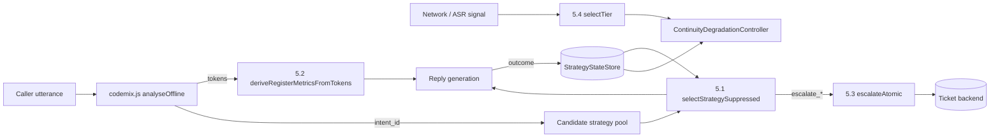
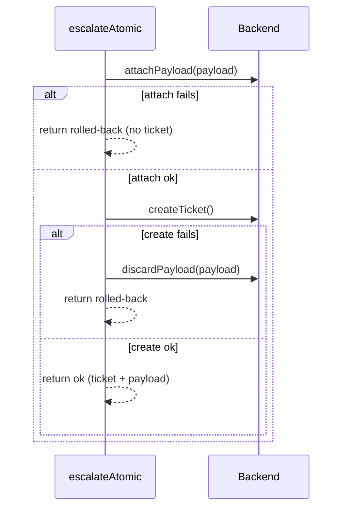

# 001 — Decision-Policy Layer: Design

## Overview
The layer sits *after* `codemix.js` understanding and *before* reply generation.
It is a set of small, pure-ish functions plus one in-memory state store, deliberately
free of dependencies so it runs in the same places the offline engine runs.
Each mechanism has a naive baseline next to it, so the harness can report a
before/after comparison instead of a single absolute number.



## Components
| Component | File | Responsibility |
|---|---|---|
| `STRATEGY_FAMILIES`, `familyOf` | `decision-policy/engine.mjs` | Group interchangeable strategies |
| `StrategyStateStore` | `decision-policy/engine.mjs` | Per-ticket outcome history; failed-family lookup |
| `selectStrategySuppressed` / `selectStrategyBaseline` | `decision-policy/engine.mjs` | Treatment / baseline strategy selection |
| `deriveRegisterMetricsFromTokens` / `deriveRegisterMetricsViaSeparateLID` | `decision-policy/engine.mjs` | Treatment / baseline register metrics |
| `FlakyTicketBackend` | `decision-policy/engine.mjs` | Seeded failure-injecting backend double |
| `escalateAtomic` / `escalateNaive` | `decision-policy/engine.mjs` | Treatment / baseline escalation |
| `selectTier` | `decision-policy/engine.mjs` | Signal → `full` / `reduced` / `offline` |
| `ContinuityDegradationController` / `NaiveDegradationController` | `decision-policy/engine.mjs` | Shared vs per-tier state |
| `mulberry32` | `decision-policy/engine.mjs` | Deterministic PRNG |
| Harness | `decision-policy/simulate.mjs` | Builds synthetic tickets, runs 4 experiments, writes JSON |
| Unit tests (planned) | `test/decision-policy.test.mjs` | Assert REQ-DP-001…007 |

## Interfaces
```js
// 5.1
class StrategyStateStore {
  recordOutcome(ticketId: string, strategyId: string, outcome: "resolved"|"failed", turnIndex: number): void
  getFailedFamilies(ticketId: string): Set<string>
  vectorFor(ticketId: string): Array<{strategyId, family, turnIndex, outcome, ts}>
}
selectStrategySuppressed(ticketId, candidates: string[], store)
  -> { selected: string, suppressed: string[], generationInvocations: number }
selectStrategyBaseline(candidates: string[])
  -> { selected: string, suppressed: [], generationInvocations: number }

// 5.2
deriveRegisterMetricsFromTokens(tokens: Array<{t, l: "hi"|"en"|"xx"}>)
  -> { codeMixRatio: number, avgTokenLen: number, sampleSize: number }
deriveRegisterMetricsViaSeparateLID(utterance: string, enWords: Set<string>) -> same shape

// 5.3  (backend contract — discardPayload is NEW, see T-003)
interface TicketBackend {
  attachPayload(payload): true            // throws on failure
  createTicket(): { ticketId: string }     // throws on failure
  discardPayload(payload): void            // compensating action; must not throw
}
escalateAtomic(payload, backend)
  -> { ticket: {ticketId}|null, payloadAttached: boolean, orphaned: false, outcome: "ok"|"rolled-back" }

// 5.4
selectTier({ packetLossPct, rttMs, asrConfidence }) -> "full"|"reduced"|"offline"
new ContinuityDegradationController(store).getFailedFamiliesForTier(ticketId, tier) -> Set<string>
```

## Data model
- **Strategy-state vector:** `Map<ticketId, Entry[]>`, append-only, in memory, per process.
  No eviction today, so long-running servers need a TTL (future spec, see Q2).
- **Register metrics:** a derived value, never stored.
- **Results file:** `decision-policy/results/run-<ISO>.json` with `meta`
  (seed, generatedAt, totals, synthetic note) and one block per experiment.

## Escalation sequence (target behaviour after T-003)


## Error handling & degradation
| Failure | Handling |
|---|---|
| Every candidate suppressed | Force `escalate_supervisor` (REQ-DP-002) |
| Empty or punctuation-only tokens | Zero metrics, no throw (REQ-DP-003) |
| Backend attach/create throws | Roll back and return `rolled-back`; never throw to caller (REQ-DP-005) |
| `discardPayload` throws | Swallow and still return `rolled-back`; log in the harness |
| Signal fields missing | Out of scope today; callers must pass all three (future hardening) |

## Test strategy
- **Unit tests (`test/decision-policy.test.mjs`, `node:assert`, no deps):** one `describe`-style block per requirement.
  - REQ-DP-006 boundary cases are table-driven.
  - REQ-DP-005 runs a fuzz loop over failure rates {0, 0.12, 0.5, 1} × 500 trials with a seeded RNG.
- **Harness check (`node decision-policy/simulate.mjs --check`):** asserts the REQ-DP-008 thresholds; wired into `npm test` and CI.
- **Parity (REQ-DP-004):** iterate every utterance in all three datasets.
- **Doc check (REQ-DP-009):** manual PR review checklist in T-007; not automated.

## Risks & alternatives considered
- **Family matching vs embeddings:** family matching is deterministic, dependency-free, and testable; embeddings would break constitution §4 for the core. Deferred to Q1.
- **Attach-then-create vs create-then-attach:** attach-first means a failed create leaves only a discardable payload, never a visible empty ticket. It relies on the backend supporting `discardPayload`.
- **In-memory store:** simple and fast, but lost on restart and not shared across serverless instances. Acceptable only for the prototype.
- **Scripted outcomes inflate 5.1:** mitigated by honest labelling (REQ-DP-009), not by code.

## Traceability
| Requirement | Component(s) | Verified by |
|---|---|---|
| REQ-DP-001 | `StrategyStateStore`, `familyOf` | T-001 → `test/decision-policy.test.mjs` |
| REQ-DP-002 | `selectStrategySuppressed` | T-001 → `test/decision-policy.test.mjs` |
| REQ-DP-003 | `deriveRegisterMetricsFromTokens` | T-002 → `test/decision-policy.test.mjs` |
| REQ-DP-004 | both register paths, `EN_WORDS` | T-002 → `test/decision-policy.test.mjs` |
| REQ-DP-005 | `escalateAtomic`, `FlakyTicketBackend` | T-003 → `test/decision-policy.test.mjs` |
| REQ-DP-006 | `selectTier` | T-004 → `test/decision-policy.test.mjs` |
| REQ-DP-007 | `ContinuityDegradationController` | T-005 → `test/decision-policy.test.mjs` |
| REQ-DP-008 | `simulate.mjs` | T-006 → `simulate.mjs --check` |
| REQ-DP-009 | SUBMISSION.md, ARCHITECTURE.md, decision-policy/README.md | T-007 → PR review |
