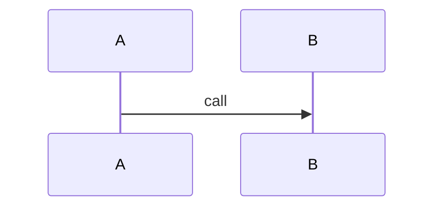

# NNN — Feature Name: Design

## Overview
One paragraph: the approach and why it was chosen over alternatives.

## Components
| Component | File | Responsibility |
|---|---|---|
|  |  |  |

## Interfaces
```js
// Public signatures, inputs, outputs, thrown errors
```

## Data model
State that is created, persisted, or passed between components.

## Flow


## Error handling & degradation
What fails, how it is detected, what the fallback is (constitution §3).

## Test strategy
Unit / integration / benchmark; which file; what is asserted.

## Risks & alternatives considered
- 

## Traceability
| Requirement | Component(s) | Verified by |
|---|---|---|
| REQ-XX-001 |  |  |
